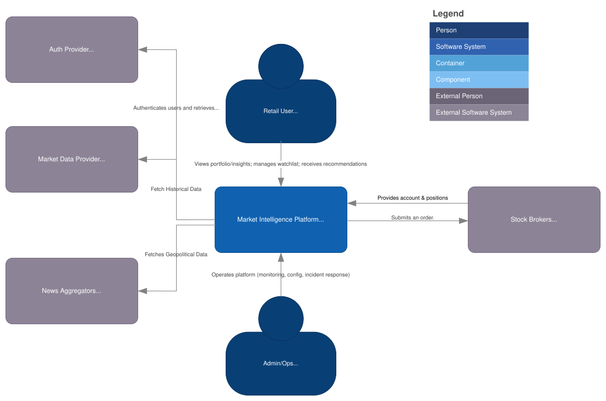

# ADR 0002: Define Target System Boundary for Market Intelligence Platform

| Metadata          | Value                                                            |
| ----------------- | ---------------------------------------------------------------- |
| **Date**          | 2026-04-30                                                       |
| **Author**        | @barto-official                                                  |
| **Status**        | `Approved`                                                       |
| **Tags**          | architecture, system-context, c4                                 |
| **Related**       | `docs/architecture/diagrams/c1-target-system-context.drawio.svg` |
| **Supersedes**    | N/A                                                              |
| **Superseded by** | N/A                                                              |

## 1) Context & Problem Statement

The project needs a clear definition of goals, no-goals, boundaries, scopes, and architecture context. This prevents from scope explosion, technology-first design, and misaligned implementation.

The architecture needs a clear boundary that answers:

- What is the system under design?
- Which capabilities belong inside the platform?
- Which actors and systems are external dependencies?
- How do we prevent future-facing context diagrams from creating MVP scope creep?

## 2) Decision

The Market Intelligence Platform helps active retail investors maintain investing context
and eventually translate market, news, and geopolitical events into portfolio-aware,
risk-aware insights. The solution will be built iteratively but the first architecture and system scope should be defined up-front for better planning and scaling of the project.

## 3) Out Of Scope

- HFT execution infrastructure (colocation, ultra-low-latency order routing, microstructure optimizations)
- “Guaranteed returns” positioning or anything resembling it
- Full multi-asset coverage (start with equities/ETFs; add others only after quality is proven)
- Complex derivatives strategy automation before compliance, risk controls, and user sophistication gates
- Building a full broker-dealer stack from scratch (prefer partnerships/integrations)

## 4) Design

We will name the target system **Market Intelligence Platform** in the C1 System Context diagram. The C1 diagram represents the intended target system context. Inclusion of an actor or external system defines the eventual boundary and relationship, but does not commit that integration to the initial release.

### Decision Scope

- **In scope:**

  - System boundary definition
  - C1 target-context naming
  - External actors and external software systems
  - Current versus future dependency classification
  - Relationship-level framing between the platform and external systems

- **Out of scope:**

  - Decision on Tooling

- **Non-goals:**

  - Do not decide how the platform is internally decomposed.
  - Do not decide which technologies are used.
  - Do not imply that all target-context integrations are MVP scope.
  - Do not model internal containers, databases, queues, workers, or services in this ADR.

### Affected Architecture Views

- C4 System Context Diagram:
  - `docs/architecture/diagrams/c1-target-system-context.drawio`

