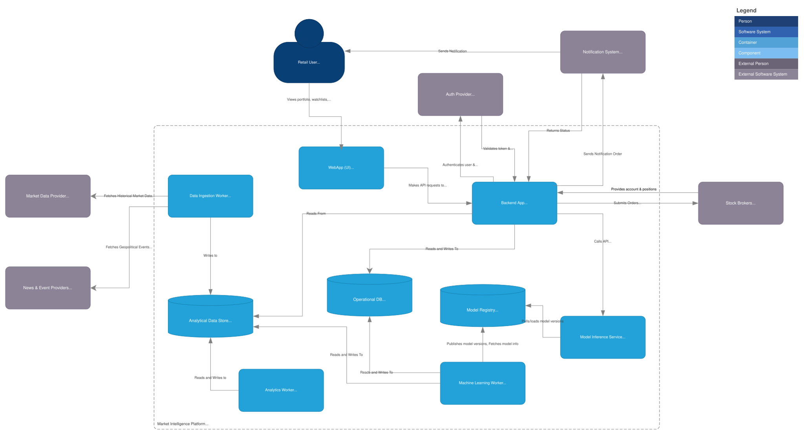

# ADR 0004: Use Modular Monolith with Separate Batch Ingestion Jobs

| Metadata          | Value                                                                                                      |
| ----------------- | ---------------------------------------------------------------------------------------------------------- |
| **Date**          | 2026-04-30                                                                                                 |
| **Author**        | @barto-official                                                                                            |
| **Status**        | `Proposed`                                                                                                 |
| **Tags**          | architecture, architecture-style, modular-monolith, batch-ingestion, c2                                    |
| **Related**       | `docs/architecture/0002-system-context.md`, `docs/architecture/diagrams/c2-target-architecture.drawio.svg` |
| **Supersedes**    | N/A                                                                                                        |
| **Superseded by** | N/A                                                                                                        |

## 1) Context & Problem Statement

Problem Statement: We need an initial architecture style that supports clear domain boundaries without introducing unnecessary distributed-system complexity.

Forces:

- One developer / small-team project initially.
- Need fast iteration and low operational overhead.
- Need clean boundaries for future evolution.
- Data Ingestion as a high priority — Batch-only at the beginning but streaming as a later add-on.
- Microservices would add deployment, networking, observability, and data-consistency complexity too early.

## 2) Decision & Design

### Decision Statement

We will start with a **modular monolith** for product-facing backend capabilities, plus **separate batch-oriented ingestion jobs** for market data ingestion and processing.

### Decision Details

Modular monolith with separate batch ingestion jobs — one deployable backend application, but internally organized by domain modules. Each module owns its domain concepts and exposes explicit interfaces to other modules. Data ingestion (batch and streaming) might be based on event-driven and still live in the same repository.

- We will implement the product-facing backend as one deployable application.
- Internal modules will represent domain boundaries.
- We will run ingestion outside the request/response path.
- We will use batch ingestion as the default ingestion mode.
- We will defer streaming-first architecture.
- We will defer microservices.
- We will design module boundaries so future extraction remains possible.

| Need                                           | Why it fits the requirements          |
| ---------------------------------------------- | ------------------------------------- |
| Fast iteration                                 | One backend deployable                |
| Clear domain boundaries                        | Modules align with DDD-light contexts |
| Lower operational complexity                   | No distributed services yet           |
| Future extraction path                         | Modules can later become services     |
| Easier local development                       | One backend app + workers             |
| Stronger maintainability than layered monolith | Domain-oriented code organization     |

### Decision Scope

- **In scope:** initial architecture style, runtime separation between backend and ingestion jobs, module-boundary strategy.
- **Out of scope:** concrete frameworks, database choice, cloud provider, auth provider, observability vendor, detailed API design.
- **Assumptions:** first users and workloads do not require independent service scaling.
- **Non-goals:** no microservices, no streaming-first architecture, no broker execution architecture in the initial platform.

### Affected Architecture Views

- `docs/architecture/diagrams/c2-target-architecture.drawio.svg`

### Why this option

A modular monolith gives clear boundaries with low operational complexity. Separate ingestion jobs keep long-running data workflows out of user-facing API paths. This fits the current project stage while preserving an evolution path toward services later.

### Trade-offs Accepted

- We accept less independent scaling in exchange for simpler deployment and debugging.
- We accept one backend deployable in exchange for faster iteration.
- We accept possible future extraction work to avoid premature microservices now.
- We accept shared physical persistence initially, with strict logical ownership rules.

## 4) Options Considered

1. Layered Monolith — a single backend application organized mostly by technical layers. It is simple, familiar, fast to start, and easy to deploy.

- It's not suitable because our domains are fairly independent and they matter more than generic technical layers
- If everything is organized as generic services/ and repositories/, the system can easily become a “service soup” where domain ownership is unclear.

2. Microservices — Each major domain becomes an independently deployed service. Although professional and fit the distribution of our domains, it's a technical overkill at the beginning. It makes sense to switch to microservices only if we need:

| Trigger                      | Example                                             |
| ---------------------------- | --------------------------------------------------- |
| Independent scaling          | inference service needs GPUs; backend does not      |
| Different reliability needs  | broker execution needs stricter isolation           |
| Different team ownership     | data/ML team owns models; app team owns UX/backend  |
| Different deployment cadence | model inference deploys separately                  |
| Strong compliance boundary   | execution must be separated from insight generation |
| High traffic domain          | market data serving needs separate scaling          |

Full microservices from the start would add:

- network failures
- service discovery
- distributed tracing
- contract versioning
- distributed transactions
- cross-service authorization
- more deployment pipelines
- more observability complexity
- harder local development

3. Coarse-grained services / SOA-like architecture. A middle ground between modular monolith and microservices. Instead of many tiny services, we split into a few major runtime units. It separates fundamentally different runtime concerns. The risk is that we over-split too early and will have a hard time refactoring later. **Best target architecture when scaling is needed**

1. Event-driven architecture — Parts of the system communicate by producing and consuming events. It's especially useful for moving parts with data, such as data ingestion, notification requests, feedback loops. However, it requires mature handling of event schemas, idempotency, ordering, retries, dead-letter queues, replay, deduplication, observability, schema evolution
   event versioning.

If introduced too early, we may spend more time building event plumbing than product/data foundation. Thus, **use selectively, only in parts when it makes the most sense**

## 5) Consequences

### Positive Consequences

- Simpler initial architecture.
- Faster development loop.
- Lower operational burden.
- Clear internal module boundaries.
- Easier testing and debugging.
- Future service extraction remains possible.

### Negative Consequences / New Risks

- Modular boundaries disappear. For example, importing internal database models, writing to other module's databases, bypassing policies
- Module coupling may grow if boundaries are not enforced.
- Individual capabilities cannot be deployed independently.
- Shared database ownership must be controlled.
- Future extraction may require refactoring.

### Impact on Quality Attributes

- **Performance:** Good enough for current workload; ingestion separated from API path.
- **Reliability/Availability:** Simpler system reduces failure modes.
- **Security:** Centralized authorization is simpler initially.
- **Maintainability/Evolvability:** Good if module boundaries are enforced.
- **Cost:** Lower infrastructure and operational cost.

## 6) Implementation Plan (Decision-to-Action)

### High-level Plan

1. Define backend as one modular monolith.
1. Implement domain contexts as internal modules/packages.
1. Create separate batch ingestion job/container.
1. Keep ingestion outside user request paths.

### Migration / Rollout Strategy (if applicable)

- Phases:
  - Phase 1: Modular backend + batch ingestion job.
  - Phase 2: Add stronger module boundaries and internal interfaces.
  - Phase 3: Extract services only if revisit triggers are met.
- Backward compatibility:
  - Not applicable.
- Rollback plan:
  - Not applicable; this is the initial architecture style.

## 7) Validation

### Success Criteria

- First implementation slices can be built without service orchestration overhead.
- Backend modules remain logically separated.
- Ingestion jobs do not block or degrade API requests.
- Local development remains simple.
- C2 diagram clearly separates frontend, backend, ingestion, storage, and external systems.

### How we will validate

- Architecture review of module boundaries.
- Code review for cross-module coupling.
- Integration tests for core flows.
- Basic operational tests for ingestion failure and stale data.

## 8) Revisit Triggers

This decision should be revisited if any of the following occur:

- A module needs independent scaling.
- A module needs independent deployment.
- Multiple teams need separate ownership.
- Ingestion workloads interfere with API performance.
- Failure blast radius becomes unacceptable.
- Broker execution becomes active.
- Recommendations/automation become active.
- Compliance requires runtime isolation.
- Streaming/real-time requirements become core.
- Shared database ownership becomes a persistent source of defects.
