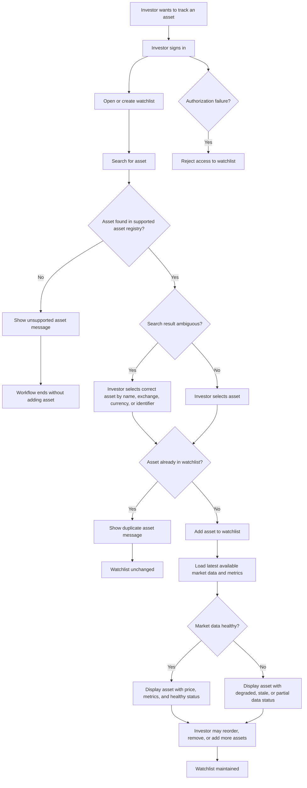
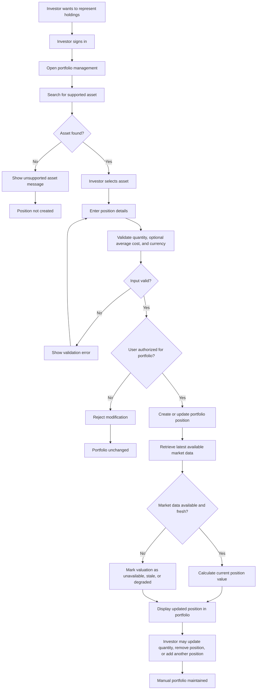
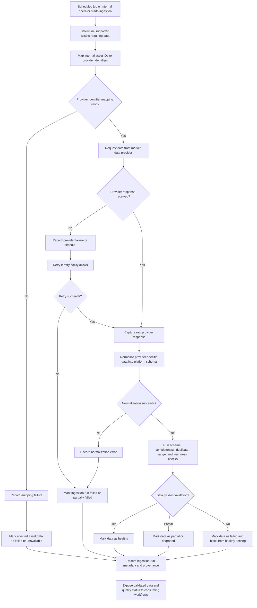
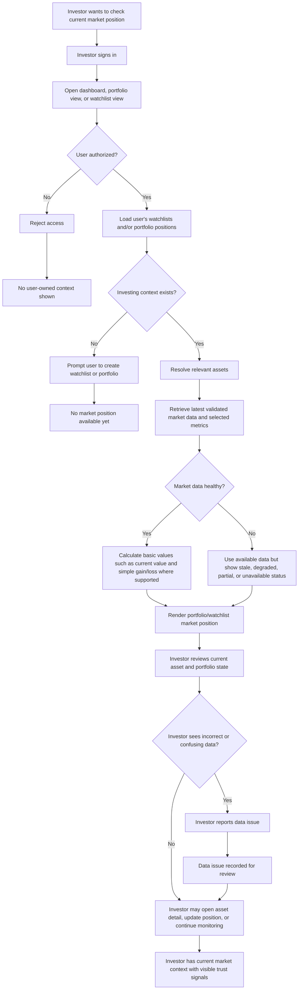

# ADR 0003: Strategic Domain-Driven Design for Market Intelligence Platform

| Metadata          | Value                                                                                                   |
| ----------------- | ------------------------------------------------------------------------------------------------------- |
| **Date**          | 2026-04-30                                                                                              |
| **Author**        | @barto-official                                                                                         |
| **Status**        | `Proposed`                                                                                              |
| **Tags**          | architecture, ddd, strategic-design, bounded-contexts                                                   |
| **Related**       | `docs/architecture/adr/0001-record-architecture-decisions.md`, `docs/architecture/adr/0002-system-context.md` |
| **Supersedes**    | N/A                                                                                                     |
| **Superseded by** | N/A                                                                                                 |

# Background

## 1) Decision & Design

### Decision Statement

We adopt Strategic Domain-Driven Design (DDD) as the architecture framing for the Market Intelligence Platform. We will define bounded contexts around business capabilities, maintain a ubiquitous language across product and engineering, and use explicit context mapping to control dependencies between ingestion, investor context, and intelligence workflows. This gives us a stable domain backbone for incremental delivery now and safer expansion later.

### Decision Details

- We will define and maintain explicit bounded contexts before deep service decomposition.
- We will establish and enforce a ubiquitous language for trust-critical and workflow-critical domain terms.
- We will isolate external provider models behind anti-corruption boundaries.
- We will separate market data ingestion/validation concerns from investor-context management concerns.
- We will make freshness, quality, and provenance first-class domain concepts in contracts and models.

### Decision Scope

- **In scope:** Strategic domain decomposition, context ownership boundaries, ubiquitous language, and context mapping.
- **Out of scope:** Final infrastructure topology, vendor/tool selection, and detailed UI behavior.
- **Assumptions:** Phase-one delivery focuses on trusted market data + investor context (watchlist/portfolio) foundations.
- **Non-goals:** Broker execution, guaranteed outcomes, autonomous investing actions, or institutional-terminal parity.

### Affected Architecture Views

- `docs/architecture/adr/0002-system-context.md`

### Why this option

Strategic DDD is the best fit because the platform’s complexity comes from business meaning, trust semantics, and evolving decision support rather than from raw throughput alone. A purely technical decomposition would optimize local implementation speed but increase long-term ambiguity and cross-team friction. DDD gives a durable model for aligning product intent, data quality guarantees, and implementation ownership, which is essential in a domain where inaccurate semantics can directly damage user trust.

## 2) Options Considered

### Option A: Strategic DDD with bounded contexts (chosen)

- **Summary:** Start from business capabilities and domain language, then align service/API boundaries to those contexts.
- **Pros:**
  - Strong semantic consistency across teams and artifacts.
  - Better ownership clarity and safer parallel development.
  - Better handling of trust-critical concerns (freshness, quality, provenance).
- **Cons / Risks:**
  - Higher initial modeling overhead.
  - Requires continuous governance to keep boundaries useful.
- **Operational Impact:** Clearer incident ownership and boundary-aware runbooks.
- **Cost Impact:** Higher short-term architecture cost, lower medium/long-term refactor cost.
- **Notes:** Best aligned with an evolving, trust-sensitive product domain.

### Option B: Technical decomposition first

- **Summary:** Decompose quickly by technical layers/services and refine domain meaning later.
- **Pros:**
  - Fast initial delivery.
  - Lower up-front architecture ceremony.
- **Cons / Risks:**
  - Higher semantic drift and duplicated rules.
  - Harder to evolve toward explainable portfolio-aware intelligence.
- **Operational Impact:** Faster start, weaker long-term ownership clarity.
- **Cost Impact:** Lower initial cost, likely higher future rework cost.

### Option C: Data-platform-first optimization

- **Summary:** Prioritize ingestion/analytics platform architecture first; domain boundaries emerge later.
- **Pros:**
  - Strong data pipeline posture early.
  - Useful for exploration and broad ingestion scale.
- **Cons / Risks:**
  - Product semantics and user-context boundaries become secondary.
  - Greater risk of provider schema leakage into product behavior.
- **Operational Impact:** Good data ops, weaker product-domain cohesion.
- **Cost Impact:** Significant early platform investment with uncertain product-alignment payoff.

## 3) Consequences

### Positive Consequences

- Shared domain language improves communication and implementation consistency.
- Bounded contexts reduce accidental coupling and improve maintainability.
- Trust signals become explicit and testable across workflows.
- Future intelligence capabilities can build on stable foundations.

### Negative Consequences / New Risks

- More up-front architecture effort before implementation details.
- Risk of over-modeling if governance is too rigid.
- Need for ongoing maintenance of context maps and glossary.

### Impact on Quality Attributes

- **Performance:** Neutral to slightly negative short-term, with better long-term optimization leverage.
- **Reliability/Availability:** Improved fault isolation and clearer degradation behavior.
- **Security:** Improved boundary control and clearer ownership of sensitive flows.
- **Maintainability/Evolvability:** Strong positive due to reduced semantic coupling.
- **Cost:** Short-term increase, long-term reduction in rework/coordination overhead.

## 4) Implementation Plan (Decision-to-Action)

### High-level Plan

1. Define initial bounded contexts and their responsibilities for phase-one scope.
2. Publish and adopt ubiquitous language across docs, APIs, and schema naming.
3. Introduce context contracts carrying freshness, quality, and provenance semantics.
4. Align backlog ownership and acceptance criteria to context boundaries.
5. Validate boundaries against the business workflows captured in this ADR.

## 5) Revisit Triggers

This decision should be revisited if any of the following occur:

- Repeated incidents reveal persistent ambiguity in context ownership.
- The context map no longer matches product behavior and causes duplicated business rules.
- Product scope expands into advanced recommendation or autonomous actions requiring new compliance/safety constraints.
- Team topology changes and current context ownership becomes impractical.
- Provider landscape changes force major anti-corruption redesign.
- Cost/performance constraints require significant context consolidation or re-segmentation.

---

# Background

## Domain

### Description

The Market Intelligence Platform domain concerns retail investor market intelligence: helping active investors maintain their investing context, monitor relevant market data, and progressively translate market, news, macro, and geopolitical events into portfolio-aware, risk-aware understanding.

The primary users are active retail investors and, later, small professional investors or independent advisors who manage portfolios or watchlists, follow market developments regularly, and need faster sensemaking than fragmented broker apps, news feeds, social media, charts, and spreadsheets provide.

Users need to know which assets they care about, what is happening in the market, which information is relevant to their holdings or watchlists, whether the data is trustworthy and fresh, and eventually how events may affect their portfolio through clear mechanisms, confidence levels, evidence, and uncertainty.

The platform manages the user’s investing context, including accounts, watchlists, manually entered portfolio positions, supported assets, asset metadata, market prices, financial metrics, data freshness, quality status, source provenance, and later event records, relevance mappings, explanations, feedback, and evaluation history.

The platform helps users reduce attention waste and decision uncertainty by consolidating market context, showing relevant asset and portfolio information in one place, surfacing trustworthy market data with freshness and quality signals, and eventually transforming raw events into portfolio-aware insights rather than opaque trading instructions.

The main difficulty is that financial information is fragmented, time-sensitive, noisy, provider-dependent, and trust-critical. Incorrect identifiers, stale prices, weak provenance, misleading explanations, or overconfident impact claims can directly damage user trust and may create compliance or safety risk.

The full scope of the implementation includes ingestion of market and financial data (historical and real-time), data quality and cleaning, data analytics through dashboard, application with user account, portfolio and watchlist management, ingestion of news,earnings, macro, regulatory, and geopolitical event ingestion, impact assessment of geopolitics on market, and trade recommendations.

The domain explicitly excludes broker-dealer functionality, guaranteed-return positioning, HFT infrastructure, full institutional-terminal replacement, complete multi-asset/global coverage from day one, complex derivatives automation, tax-lot accounting, unrestricted autonomous investing, and any workflow that implies regulated financial advice before the required product, compliance, safety, and trust gates are satisfied.

### Capabilities

1. Historical market data acquisition & management
2. Real-Time market data acquisition & management
3. Geopolitical Events data acquisition & management
4. Watchlist and portfolio management
5. Market data presentation and analytics
6. User identity and access
7. Recommendation, Prediction, forecast and of market event and prices
8. Impact Assessment
9. Portfolio-aware insight generation

### Business Workflows

#### Workflow #1: Create and Maintain Watchlist

Actors:
- Authenticated Investor
- Market Intelligence Platform
- Asset Registry
- Market Data Provider, indirectly through already-ingested data

Trigger: The investor wants to track assets they care about without entering full portfolio positions.

Main path:
1. Investor signs in.
2. Investor creates a watchlist or opens an existing watchlist.
3. Investor searches for an asset by symbol, name, exchange, or supported identifier.
4. Platform returns matching supported assets.
5. Investor selects the correct asset.
6. Platform adds the asset to the selected watchlist.
7. Platform displays the asset in the watchlist with available price, basic metrics, and freshness/quality status.
8. Investor may remove assets, reorder assets, or maintain multiple watchlists later.

Alternative paths:
- Investor adds an asset to a default watchlist without explicitly creating one.
- Investor creates multiple watchlists for different strategies or themes.
- Investor removes an asset from the watchlist.
- Platform groups assets in themes and recommends to the user a theme based on his interests.

Failure paths:
- Asset is unsupported.
- Asset search returns ambiguous symbols across exchanges.
- Asset is already in the watchlist.
- Latest market data is unavailable or stale.
- User is not authorized to modify the watchlist.
- Provider identifier mapping is missing or inconsistent.

Business outcome: The investor has a maintained list of relevant assets that can be used for recurring market checks and future personalized insights.

#### Workflow: Create and Maintain Manual Portfolio

Actors:
- Authenticated Investor
- Market Intelligence Platform
- Asset Registry
- Market Data Foundation

Trigger: The investor wants to represent their actual or simulated holdings inside the platform.

Main path:
1. Investor opens portfolio management.
2. Investor searches for a supported asset.
3. Investor selects the correct asset.
4. Investor enters position details such as quantity and, optionally, average cost.
5. Platform validates the position input.
6. Platform records or updates the portfolio position.
7. Platform calculates basic current position value using available market data.
8. Platform shows the position in the portfolio view with freshness and quality status.

Alternative paths:
- Investor updates quantity after buying or selling outside the platform.
- Investor removes a position.
- Investor enters only quantity and skips average cost.
- Investor maintains a manual paper portfolio rather than real holdings.
- Investor creates a portfolio from watchlist items.

Failure paths:
- Asset is unsupported.
- Quantity is invalid.
- Average cost is invalid or incompatible with the asset currency.
- Latest price is missing, stale, or degraded.
- User attempts to modify another user’s portfolio.
- Corporate action or symbol change makes the position difficult to interpret.

Business outcome: The investor has a user-owned portfolio context that can support valuation, monitoring, and future portfolio-aware intelligence.

**Workflow: Check Portfolio/Watchlist Market Position**

Actors:
- Authenticated Investor
- Market Intelligence Platform
- Portfolio/Watchlist Context
- Market Data Foundation
- Data Quality/Freshness Process

Trigger: The investor opens the platform to understand the current state of assets they care about.

Main path:
1. Investor signs in and opens the dashboard, portfolio view, or watchlist view.
2. Platform loads the investor’s watchlists and/or portfolio positions.
3. Platform retrieves latest available validated market data and selected financial metrics for the relevant assets.
4. Platform calculates basic derived values, such as current position value and simple gain/loss where supported.
5. Platform displays assets, positions, prices, metrics, and freshness/quality indicators.
6. Investor reviews the current state and decides whether further investigation is needed.
7. Investor may open an asset detail view, update a position, add/remove assets, or report a data issue.

Alternative paths:
- Investor checks only watchlist, not portfolio.
- Investor checks only asset detail view.
- Platform shows partial data with explicit quality/freshness indicators.
- Investor uses the dashboard as a quick daily check-in rather than a deep analysis view.

Failure paths:
- Portfolio/watchlist cannot be loaded.
- Market data is stale, missing, or degraded.
- Position valuation cannot be calculated.
- Asset metadata is incomplete.
- User sees incorrect or confusing data and reports an issue.
- Authorization failure prevents access to user-owned investing context.

Business outcome: The investor can quickly understand the current market state of assets they care about, with enough trust signals to know whether the displayed information is fresh, complete, and reliable.

#### Workflow: Ingest, Normalize, and Validate Market Data

Actors:
- Market Intelligence Platform
- Scheduled Job / Internal Operator
- External Market Data Provider
- Data Quality Process
- Asset Registry

Trigger:
A scheduled ingestion run, manual backfill, or refresh request requires the platform to obtain market data for supported assets.

Main path:
1. Platform determines which supported assets require data.
2. Platform maps internal asset identifiers to provider-specific identifiers.
3. Platform requests price, metric, or metadata data from the external provider.
4. Platform captures raw provider response or source snapshot.
5. Platform normalizes provider-specific data into platform-standard market data records.
6. Platform validates schema, completeness, duplicates, ranges, and freshness.
7. Platform records ingestion run metadata, status, errors, source information, and processing timestamps.
8. Platform marks market data as healthy, partial, degraded, stale, or failed.
9. Validated data becomes available to portfolio, watchlist, asset detail, and dashboard views.

Alternative paths:
- Platform performs historical backfill instead of latest-price refresh.
- Platform partially succeeds for some assets and fails for others.
- Platform accepts data but marks it degraded due to missing metrics.
- Platform skips unsupported or inactive assets.
- Platform retries transient provider failures.

Failure paths:
- Provider is unavailable.
- Provider rate limit is exceeded.
- Provider identifier mapping is incorrect.
- Raw data schema changes unexpectedly.
- Data contains impossible values, such as negative prices.
- Data is stale beyond the allowed threshold.
- Ingestion succeeds technically but fails quality validation.

Business outcome:
The platform has trusted, traceable, and quality-labeled market data available for user-facing investment context workflows.

