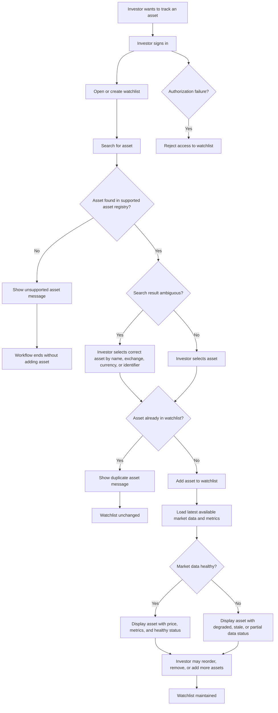
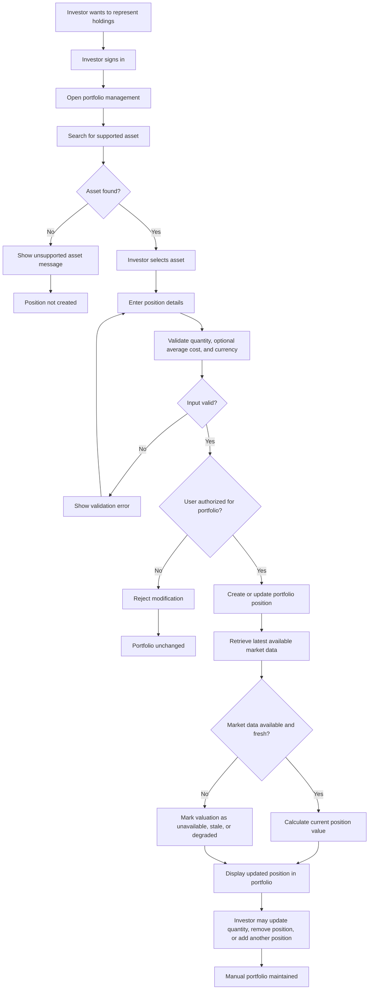
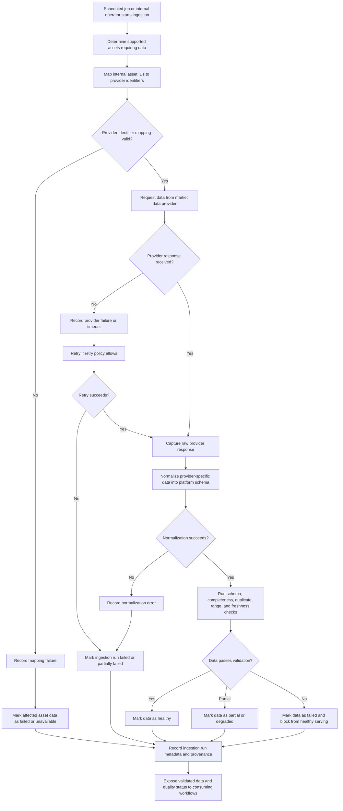
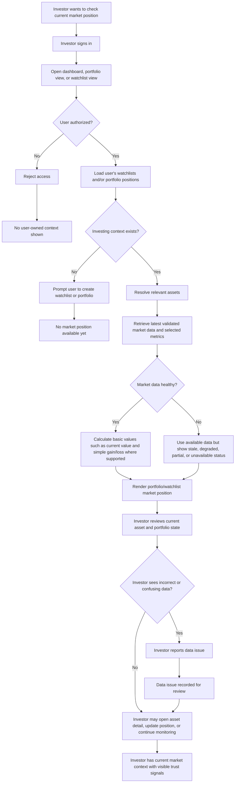
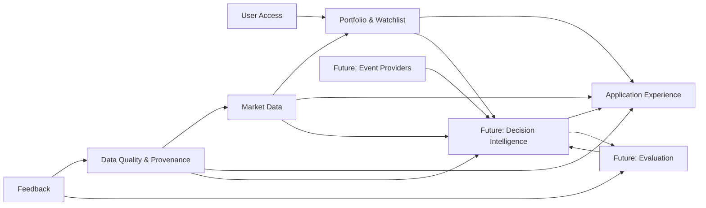

# ADR 0003: Strategic Domain-Driven Design for Market Intelligence Platform

| Metadata          | Value                                                                                                         |
| ----------------- | ------------------------------------------------------------------------------------------------------------- |
| **Date**          | 2026-04-30                                                                                                    |
| **Author**        | @barto-official                                                                                               |
| **Status**        | `Proposed`                                                                                                    |
| **Tags**          | architecture, ddd, strategic-design, bounded-contexts                                                         |
| **Related**       | `docs/architecture/adr/0002-system-context.md` |
| **Supersedes**    | N/A                                                                                                           |
| **Superseded by** | N/A                                                                                                       |

# Background

## 1) Decision & Design

### Decision Statement

We adopt Strategic Domain-Driven Design (DDD) as the architecture framing for the Market Intelligence Platform. We will define bounded contexts around business capabilities, maintain a ubiquitous language across product and engineering, and use explicit context mapping to control dependencies between ingestion, investor context, and intelligence workflows. This gives us a stable domain backbone for incremental delivery now and safer expansion later.

### Decision Details

- We will define and maintain explicit bounded contexts before deep service decomposition.
- We will establish and enforce a ubiquitous language for trust-critical and workflow-critical domain terms.
- We will isolate external provider models behind anti-corruption boundaries.
- We will separate market data ingestion/validation concerns from investor-context management concerns.
- We will make freshness, quality, and provenance first-class domain concepts in contracts and models.

### Decision Scope

- **In scope:** Strategic domain decomposition, context ownership boundaries, ubiquitous language, and context mapping.
- **Out of scope:** Final infrastructure topology, vendor/tool selection, and detailed UI behavior.
- **Assumptions:** Phase-one delivery focuses on trusted market data + investor context (watchlist/portfolio) foundations.
- **Non-goals:** Broker execution, guaranteed outcomes, autonomous investing actions, or institutional-terminal parity.

### Affected Architecture Views

- `docs/architecture/adr/0002-system-context.md`

### Why this option

Strategic DDD is the best fit because the platform’s complexity comes from business meaning, trust semantics, and evolving decision support rather than from raw throughput alone. A purely technical decomposition would optimize local implementation speed but increase long-term ambiguity and cross-team friction. DDD gives a durable model for aligning product intent, data quality guarantees, and implementation ownership, which is essential in a domain where inaccurate semantics can directly damage user trust.

## 2) Options Considered

### Option A: Strategic DDD with bounded contexts (chosen)

- **Summary:** Start from business capabilities and domain language, then align service/API boundaries to those contexts.
- **Pros:**
  - Strong semantic consistency across teams and artifacts.
  - Better ownership clarity and safer parallel development.
  - Better handling of trust-critical concerns (freshness, quality, provenance).
- **Cons / Risks:**
  - Higher initial modeling overhead.
  - Requires continuous governance to keep boundaries useful.
- **Operational Impact:** Clearer incident ownership and boundary-aware runbooks.
- **Cost Impact:** Higher short-term architecture cost, lower medium/long-term refactor cost.
- **Notes:** Best aligned with an evolving, trust-sensitive product domain.

### Option B: Technical decomposition first

- **Summary:** Decompose quickly by technical layers/services and refine domain meaning later.
- **Pros:**
  - Fast initial delivery.
  - Lower up-front architecture ceremony.
- **Cons / Risks:**
  - Higher semantic drift and duplicated rules.
  - Harder to evolve toward explainable portfolio-aware intelligence.
- **Operational Impact:** Faster start, weaker long-term ownership clarity.
- **Cost Impact:** Lower initial cost, likely higher future rework cost.

### Option C: Data-platform-first optimization

- **Summary:** Prioritize ingestion/analytics platform architecture first; domain boundaries emerge later.
- **Pros:**
  - Strong data pipeline posture early.
  - Useful for exploration and broad ingestion scale.
- **Cons / Risks:**
  - Product semantics and user-context boundaries become secondary.
  - Greater risk of provider schema leakage into product behavior.
- **Operational Impact:** Good data ops, weaker product-domain cohesion.
- **Cost Impact:** Significant early platform investment with uncertain product-alignment payoff.

## 3) Consequences

### Positive Consequences

- Shared domain language improves communication and implementation consistency.
- Bounded contexts reduce accidental coupling and improve maintainability.
- Trust signals become explicit and testable across workflows.
- Future intelligence capabilities can build on stable foundations.

### Negative Consequences / New Risks

- More up-front architecture effort before implementation details.
- Risk of over-modeling if governance is too rigid.
- Need for ongoing maintenance of context maps and glossary.

### Impact on Quality Attributes

- **Performance:** Neutral to slightly negative short-term, with better long-term optimization leverage.
- **Reliability/Availability:** Improved fault isolation and clearer degradation behavior.
- **Security:** Improved boundary control and clearer ownership of sensitive flows.
- **Maintainability/Evolvability:** Strong positive due to reduced semantic coupling.
- **Cost:** Short-term increase, long-term reduction in rework/coordination overhead.

## 4) Implementation Plan (Decision-to-Action)

### High-level Plan

1. Define initial bounded contexts and their responsibilities for phase-one scope.
1. Publish and adopt ubiquitous language across docs, APIs, and schema naming.
1. Introduce context contracts carrying freshness, quality, and provenance semantics.
1. Align backlog ownership and acceptance criteria to context boundaries.
1. Validate boundaries against the business workflows captured in this ADR.

## 5) Revisit Triggers

This decision should be revisited if any of the following occur:

- Repeated incidents reveal persistent ambiguity in context ownership.
- The context map no longer matches product behavior and causes duplicated business rules.
- Product scope expands into advanced recommendation or autonomous actions requiring new compliance/safety constraints.
- Team topology changes and current context ownership becomes impractical.
- Provider landscape changes force major anti-corruption redesign.
- Cost/performance constraints require significant context consolidation or re-segmentation.

______________________________________________________________________

# Background

## Domain

### Description

The Market Intelligence Platform domain concerns retail investor market intelligence: helping active investors maintain their investing context, monitor relevant market data, and progressively translate market, news, macro, and geopolitical events into portfolio-aware, risk-aware understanding.

The primary users are active retail investors and, later, small professional investors or independent advisors who manage portfolios or watchlists, follow market developments regularly, and need faster sensemaking than fragmented broker apps, news feeds, social media, charts, and spreadsheets provide.

Users need to know which assets they care about, what is happening in the market, which information is relevant to their holdings or watchlists, whether the data is trustworthy and fresh, and eventually how events may affect their portfolio through clear mechanisms, confidence levels, evidence, and uncertainty.

The platform manages the user’s investing context, including accounts, watchlists, manually entered portfolio positions, supported assets, asset metadata, market prices, financial metrics, data freshness, quality status, source provenance, and later event records, relevance mappings, explanations, feedback, and evaluation history.

The platform helps users reduce attention waste and decision uncertainty by consolidating market context, showing relevant asset and portfolio information in one place, surfacing trustworthy market data with freshness and quality signals, and eventually transforming raw events into portfolio-aware insights rather than opaque trading instructions.

The main difficulty is that financial information is fragmented, time-sensitive, noisy, provider-dependent, and trust-critical. Incorrect identifiers, stale prices, weak provenance, misleading explanations, or overconfident impact claims can directly damage user trust and may create compliance or safety risk.

The full scope of the implementation includes ingestion of market and financial data (historical and real-time), data quality and cleaning, data analytics through dashboard, application with user account, portfolio and watchlist management, ingestion of news,earnings, macro, regulatory, and geopolitical event ingestion, impact assessment of geopolitics on market, and trade recommendations.

The domain explicitly excludes broker-dealer functionality, guaranteed-return positioning, HFT infrastructure, full institutional-terminal replacement, complete multi-asset/global coverage from day one, complex derivatives automation, tax-lot accounting, unrestricted autonomous investing, and any workflow that implies regulated financial advice before the required product, compliance, safety, and trust gates are satisfied.

### Capabilities

1. Historical market data acquisition & management
1. Real-Time market data acquisition & management
1. Geopolitical Events data acquisition & management
1. Watchlist and portfolio management
1. Market data presentation and analytics
1. User identity and access
1. Recommendation, Prediction, forecast and of market event and prices
1. Impact Assessment
1. Portfolio-aware insight generation

### Business Workflows

#### Workflow #1: Create and Maintain Watchlist

Actors:

- Authenticated Investor
- Market Intelligence Platform
- Asset Registry
- Market Data Provider, indirectly through already-ingested data

Trigger: The investor wants to track assets they care about without entering full portfolio positions.

Main path:

1. Investor signs in.
1. Investor creates a watchlist or opens an existing watchlist.
1. Investor searches for an asset by symbol, name, exchange, or supported identifier.
1. Platform returns matching supported assets.
1. Investor selects the correct asset.
1. Platform adds the asset to the selected watchlist.
1. Platform displays the asset in the watchlist with available price, basic metrics, and freshness/quality status.
1. Investor may remove assets, reorder assets, or maintain multiple watchlists later.

Alternative paths:

- Investor adds an asset to a default watchlist without explicitly creating one.
- Investor creates multiple watchlists for different strategies or themes.
- Investor removes an asset from the watchlist.
- Platform groups assets in themes and recommends to the user a theme based on his interests.

Failure paths:

- Asset is unsupported.
- Asset search returns ambiguous symbols across exchanges.
- Asset is already in the watchlist.
- Latest market data is unavailable or stale.
- User is not authorized to modify the watchlist.
- Provider identifier mapping is missing or inconsistent.

Business outcome: The investor has a maintained list of relevant assets that can be used for recurring market checks and future personalized insights.

#### Workflow: Create and Maintain Manual Portfolio

Actors:

- Authenticated Investor
- Market Intelligence Platform
- Asset Registry
- Market Data Foundation

Trigger: The investor wants to represent their actual or simulated holdings inside the platform.

Main path:

1. Investor opens portfolio management.
1. Investor searches for a supported asset.
1. Investor selects the correct asset.
1. Investor enters position details such as quantity and, optionally, average cost.
1. Platform validates the position input.
1. Platform records or updates the portfolio position.
1. Platform calculates basic current position value using available market data.
1. Platform shows the position in the portfolio view with freshness and quality status.

Alternative paths:

- Investor updates quantity after buying or selling outside the platform.
- Investor removes a position.
- Investor enters only quantity and skips average cost.
- Investor maintains a manual paper portfolio rather than real holdings.
- Investor creates a portfolio from watchlist items.

Failure paths:

- Asset is unsupported.
- Quantity is invalid.
- Average cost is invalid or incompatible with the asset currency.
- Latest price is missing, stale, or degraded.
- User attempts to modify another user’s portfolio.
- Corporate action or symbol change makes the position difficult to interpret.

Business outcome: The investor has a user-owned portfolio context that can support valuation, monitoring, and future portfolio-aware intelligence.

**Workflow: Check Portfolio/Watchlist Market Position**

Actors:

- Authenticated Investor
- Market Intelligence Platform
- Portfolio/Watchlist Context
- Market Data Foundation
- Data Quality/Freshness Process

Trigger: The investor opens the platform to understand the current state of assets they care about.

Main path:

1. Investor signs in and opens the dashboard, portfolio view, or watchlist view.
1. Platform loads the investor’s watchlists and/or portfolio positions.
1. Platform retrieves latest available validated market data and selected financial metrics for the relevant assets.
1. Platform calculates basic derived values, such as current position value and simple gain/loss where supported.
1. Platform displays assets, positions, prices, metrics, and freshness/quality indicators.
1. Investor reviews the current state and decides whether further investigation is needed.
1. Investor may open an asset detail view, update a position, add/remove assets, or report a data issue.

Alternative paths:

- Investor checks only watchlist, not portfolio.
- Investor checks only asset detail view.
- Platform shows partial data with explicit quality/freshness indicators.
- Investor uses the dashboard as a quick daily check-in rather than a deep analysis view.

Failure paths:

- Portfolio/watchlist cannot be loaded.
- Market data is stale, missing, or degraded.
- Position valuation cannot be calculated.
- Asset metadata is incomplete.
- User sees incorrect or confusing data and reports an issue.
- Authorization failure prevents access to user-owned investing context.

Business outcome: The investor can quickly understand the current market state of assets they care about, with enough trust signals to know whether the displayed information is fresh, complete, and reliable.

#### Workflow: Ingest, Normalize, and Validate Market Data

Actors:

- Market Intelligence Platform
- Scheduled Job / Internal Operator
- External Market Data Provider
- Data Quality Process
- Asset Registry

Trigger:
A scheduled ingestion run, manual backfill, or refresh request requires the platform to obtain market data for supported assets.

Main path:

1. Platform determines which supported assets require data.
1. Platform maps internal asset identifiers to provider-specific identifiers.
1. Platform requests price, metric, or metadata data from the external provider.
1. Platform captures raw provider response or source snapshot.
1. Platform normalizes provider-specific data into platform-standard market data records.
1. Platform validates schema, completeness, duplicates, ranges, and freshness.
1. Platform records ingestion run metadata, status, errors, source information, and processing timestamps.
1. Platform marks market data as healthy, partial, degraded, stale, or failed.
1. Validated data becomes available to portfolio, watchlist, asset detail, and dashboard views.

Alternative paths:

- Platform performs historical backfill instead of latest-price refresh.
- Platform partially succeeds for some assets and fails for others.
- Platform accepts data but marks it degraded due to missing metrics.
- Platform skips unsupported or inactive assets.
- Platform retries transient provider failures.

Failure paths:

- Provider is unavailable.
- Provider rate limit is exceeded.
- Provider identifier mapping is incorrect.
- Raw data schema changes unexpectedly.
- Data contains impossible values, such as negative prices.
- Data is stale beyond the allowed threshold.
- Ingestion succeeds technically but fails quality validation.

Business outcome:
The platform has trusted, traceable, and quality-labeled market data available for user-facing investment context workflows.

### Pain Points

**Pain point: Ambiguous asset identity**

- Workflow: Create and Maintain Watchlist; Create and Maintain Manual Portfolio
- Description: The same ticker symbol may refer to different instruments across exchanges, providers, or asset classes.
- Why it matters: Users may add or value the wrong asset.
- Possible consequence: Loss of trust, incorrect portfolio valuation, incorrect future insights.
- DDD implication: Asset, Symbol, Exchange, ProviderIdentifier, and SupportedAsset need precise language and ownership.

**Pain point: Stale or degraded market data may look trustworthy**

- Workflow: Check Portfolio/Watchlist Market Position
- Description: Users may assume displayed prices and metrics are current unless freshness and quality status are explicit.
- Why it matters: Investment decisions are time-sensitive.
- Possible consequence: User acts on outdated or incomplete information.
- DDD implication: Freshness, QualityStatus, and DataProvenance should be explicit domain concepts.

**Pain point: Provider schema or identifier changes can break ingestion**

- Workflow: Ingest, Normalize, and Validate Market Data
- Description: External provider data formats, symbols, fields, or semantics may change.
- Why it matters: Data pipelines can fail silently or produce incorrect normalized data.
- Possible consequence: Incorrect data served to users.
- DDD implication: RawProviderResponse, NormalizedMarketData, IngestionRun, and ValidationResult should be explicit concepts.

**Pain point: Users need confidence without receiving financial advice**

- Workflow: Check Portfolio/Watchlist Market Position; future insight workflows
- Description: The platform must help users understand market context without implying guaranteed outcomes or regulated advice.
- Why it matters: Finance is trust-critical and compliance-sensitive.
- Possible consequence: Regulatory, reputational, and user-trust risk.
- DDD implication: Separate information, insight, recommendation, and action concepts carefully.

### Actors

- Authenticated Investor
- Internal Operator
- Scheduled Ingestion Job
- Market Data Provider
- Market Intelligence Platform
- Asset Registry
- Data Quality Process
- Authorization Mechanism

### Commands / Queries

- CreateWatchlist
- RenameWatchlist
- DeleteWatchlist
- SearchAsset
- AddAssetToWatchlist
- RemoveAssetFromWatchlist
- CreatePortfolio
- RenamePortfolio
- DeletePortfolio
- AddPosition
- UpdatePosition
- RemovePosition
- RunMarketDataIngestion
- RunHistoricalBackfill
- ResolveProviderIdentifiers
- RequestProviderMarketData
- CaptureRawMarketData
- NormalizeMarketData
- ValidateMarketData
- CalculateFreshnessStatus
- PublishMarketDataForServing
- ViewDashboard
- ViewPortfolio
- ViewWatchlist
- ViewAssetDetail
- CalculatePortfolioValuation
- ReportDataIssue

### Events

- WatchlistCreated

- WatchlistRenamed

- WatchlistDeleted

- AssetSearchPerformed

- AssetSearchReturned

- AssetAddedToWatchlist

- AssetRemovedFromWatchlist

- WatchlistAssetAdditionRejected

- PortfolioCreated

- PortfolioRenamed

- PortfolioDeleted

- PositionAdded

- PositionUpdated

- PositionRemoved

- PositionEntryRejected

- MarketDataIngestionStarted

- HistoricalBackfillStarted

- ProviderIdentifiersResolved

- ProviderIdentifierResolutionFailed

- ProviderDataRequested

- ProviderDataReceived

- ProviderDataRequestFailed

- RawMarketDataCaptured

- MarketDataNormalized

- MarketDataNormalizationFailed

- MarketDataValidated

- MarketDataValidationFailed

- MarketDataMarkedHealthy

- MarketDataMarkedDegraded

- MarketDataMarkedStale

- MarketDataPublishedForServing

- MarketDataIngestionCompleted

- MarketDataIngestionPartiallyCompleted

- MarketDataIngestionFailed

- DashboardViewed

- PortfolioViewed

- WatchlistViewed

- AssetDetailViewed

- PortfolioValuationCalculated

- PortfolioValuationPartiallyCalculated

- PortfolioValuationFailed

- MarketPositionDisplayed

- MarketPositionDisplayDegraded

- DataIssueReported

- DataIssueTriageStarted

- DataIssueResolved

### Policies

- User-owned context access policy
- Supported asset policy
- Duplicate watchlist asset policy
- Asset identity disambiguation policy
- Portfolio ownership policy
- Manual portfolio accuracy policy
- Basic valuation policy
- Provider identifier resolution policy
- Raw data capture policy
- Data normalization policy
- Data validation policy
- Quality status policy
- Freshness policy
- Publish only validated data policy
- Retry policy
- Partial valuation policy
- Trust signal display policy
- Issue feedback policy

### Read Models

- Watchlist Overview
- Watchlist Detail
- Asset Search Result
- Portfolio Overview
- Portfolio Position List
- Position Detail
- Ingestion Run Status
- Market Data Quality View
- Asset Market Data View
- Provider Mapping View
- Dashboard View
- Portfolio Market Position View
- Watchlist Market Position View
- Asset Detail View
- Data Issue Submission View

### Pain Points

- Ambiguous asset identity
- Unsupported assets
- Provider identifier mismatch
- Provider schema changes
- Partial ingestion success
- Stale but technically successful data
- Manual portfolio drift
- Cost basis complexity
- Corporate actions
- Currency mismatch
- User may overtrust degraded data
- Portfolio valuation may be incomplete
- Dashboard may blur facts and insights
- User feedback may lack diagnostic context

### Business Rules

| ID     | Rule                                                                                | Applies To                           | Reason                                                   | Exception                         |
| ------ | ----------------------------------------------------------------------------------- | ------------------------------------ | -------------------------------------------------------- | --------------------------------- |
| BR-001 | A user can only access their own investing context.                                 | Watchlists, portfolios, positions    | Financial context is private.                            | Future admin/support access.      |
| BR-002 | Only supported assets can be added to watchlists or portfolios.                     | Watchlist, portfolio                 | Reliable data requires supported assets.                 | Future requested/custom assets.   |
| BR-003 | Platform assets must have stable internal identities.                               | Asset registry, ingestion, portfolio | Symbols and provider IDs are ambiguous.                  | None.                             |
| BR-004 | Provider identifiers must map unambiguously before data can be attached.            | Ingestion                            | Prevent wrong data association.                          | Ambiguous mappings go to review.  |
| BR-005 | A watchlist asset is not a portfolio position.                                      | Watchlist, portfolio                 | Tracking and ownership differ.                           | None.                             |
| BR-006 | A manual portfolio position is user-maintained, not broker-verified.                | Portfolio                            | Manual state can drift.                                  | Future broker sync.               |
| BR-007 | Position quantity must be valid for the supported position model.                   | Portfolio                            | Invalid quantity creates invalid valuation.              | Future short positions.           |
| BR-008 | Average cost is optional unless P&L is shown.                                       | Portfolio                            | Reduce friction and avoid misleading P&L.                | P&L requires cost basis.          |
| BR-009 | Raw provider responses should be captured before normalization when feasible.       | Ingestion                            | Auditability and replay.                                 | Licensing restrictions.           |
| BR-010 | Provider data must be normalized before product-facing use.                         | Market data serving                  | Prevent provider schema leakage.                         | Internal diagnostics.             |
| BR-011 | Market data must pass validation or be explicitly marked degraded before serving.   | Market data serving                  | Avoid silent wrong outputs.                              | Internal/admin diagnostics.       |
| BR-012 | Technical ingestion success does not imply business data quality.                   | Ingestion, quality                   | Data may be stale/incomplete despite successful request. | None.                             |
| BR-013 | Freshness must be tracked separately from validity.                                 | Data quality                         | Valid data may be stale.                                 | Historical data semantics differ. |
| BR-014 | Impossible or suspicious values must not be served as healthy data.                 | Validation                           | Prevent misleading outputs.                              | Field-specific semantics.         |
| BR-015 | Partial ingestion success must be represented explicitly.                           | Ingestion, views                     | Avoid hiding missing data.                               | None.                             |
| BR-016 | Portfolio valuation must distinguish complete, partial, and failed valuation.       | Portfolio view                       | Avoid misleading total value.                            | None.                             |
| BR-017 | Portfolio valuation must not silently ignore failed positions.                      | Portfolio view                       | Excluding failed positions distorts value.               | Explicit user filtering.          |
| BR-018 | User-facing degraded data must show quality/freshness status.                       | UI/read models                       | Trust requires visible uncertainty.                      | None.                             |
| BR-019 | Reporting a data issue does not immediately change market data.                     | Feedback, data quality               | Reports require validation.                              | Severe confirmed incident.        |
| BR-020 | Raw market data, calculated valuation, and future insights must be distinguishable. | Dashboard, future insights           | Avoid confusing facts with advice.                       | None.                             |

### Exceptions

| ID     | Failure Case                    | Workflow                 | Detection                       | Expected Handling                  | Event / Outcome                                        |
| ------ | ------------------------------- | ------------------------ | ------------------------------- | ---------------------------------- | ------------------------------------------------------ |
| FC-001 | Unsupported asset               | Watchlist, Portfolio     | Asset not in supported registry | Reject add/create action           | WatchlistAssetAdditionRejected / PositionEntryRejected |
| FC-002 | Ambiguous asset identifier      | Watchlist, Portfolio     | Multiple matching assets        | Require disambiguation             | AssetSearchReturned / Addition rejected                |
| FC-003 | Duplicate watchlist asset       | Watchlist                | Same asset_id already present   | Reject or no-op                    | WatchlistAssetAdditionRejected                         |
| FC-004 | Unauthorized access             | All user-owned contexts  | user_id mismatch                | Reject and audit                   | AccessDenied                                           |
| FC-005 | Invalid quantity                | Portfolio                | Quantity validation fails       | Reject position command            | PositionEntryRejected                                  |
| FC-006 | Invalid average cost            | Portfolio                | Cost validation fails           | Reject or allow without cost       | PositionEntryRejected / PositionAdded                  |
| FC-007 | Duplicate portfolio position    | Portfolio                | Position for same asset exists  | Reject or route to update          | PositionEntryRejected / PositionUpdated                |
| FC-008 | Provider unavailable            | Market data ingestion    | Timeout/5xx/network error       | Retry, then mark failed/partial    | ProviderDataRequestFailed                              |
| FC-009 | Provider rate limit exceeded    | Market data ingestion    | 429/quota response              | Delay/stop requests                | MarketDataIngestionPartiallyCompleted                  |
| FC-010 | Missing provider mapping        | Market data ingestion    | No provider identifier          | Skip asset, record failure         | ProviderIdentifierResolutionFailed                     |
| FC-011 | Ambiguous provider mapping      | Market data ingestion    | Multiple mappings               | Block attachment, manual review    | ProviderIdentifierResolutionFailed                     |
| FC-012 | Provider schema changed         | Market data ingestion    | Normalization/schema failure    | Block publish, alert               | MarketDataNormalizationFailed                          |
| FC-013 | Invalid market data value       | Market data validation   | Sanity/range check fails        | Mark failed/degraded               | MarketDataValidationFailed                             |
| FC-014 | Stale provider data             | Market data validation   | Freshness check fails           | Mark stale/degraded                | MarketDataMarkedStale                                  |
| FC-015 | Partial ingestion success       | Market data ingestion    | Mixed result summary            | Publish valid data, mark failures  | MarketDataIngestionPartiallyCompleted                  |
| FC-016 | Duplicate ingestion records     | Market data ingestion    | Idempotency/unique check        | Ignore/update idempotently         | DuplicateMarketDataDetected                            |
| FC-017 | Investing context not found     | Dashboard/view           | No portfolio/watchlist          | Show empty state                   | MarketPositionDisplayUnavailable                       |
| FC-018 | Market data missing             | Portfolio/watchlist view | No usable data                  | Show unavailable/degraded state    | MarketPositionDisplayDegraded                          |
| FC-019 | Portfolio valuation failed      | Portfolio view           | No calculable positions         | Show valuation unavailable         | PortfolioValuationFailed                               |
| FC-020 | Portfolio valuation partial     | Portfolio view           | Some positions unvalued         | Show partial valuation             | PortfolioValuationPartiallyCalculated                  |
| FC-021 | Currency conversion unsupported | Portfolio view           | Currency mismatch               | Mark valuation partial/unavailable | PortfolioValuationPartiallyCalculated                  |
| FC-022 | User reports data issue         | Portfolio/watchlist view | User report                     | Create issue, do not mutate data   | DataIssueReported                                      |
| FC-023 | Unknown data quality status     | Market data serving      | Missing quality metadata        | Treat as degraded/unavailable      | MarketPositionDisplayDegraded                          |
| FC-024 | Raw storage restricted          | Ingestion/provenance     | Provider license restriction    | Store allowed provenance metadata  | ProvenanceCapturedPartially                            |

Severity 1: Must block operation

- Unauthorized access
- Ambiguous provider mapping
- Invalid market data value
- Provider schema change
- Unsupported asset for portfolio/watchlist in V1

Severity 2: Can proceed with degraded output

- Stale market data
- Missing metrics
- Partial ingestion
- Partial portfolio valuation

Severity 3: User/product friction

- Duplicate watchlist asset
- Empty investing context
- Unsupported asset search demand
- Invalid form input

Severity 4: Operational/compliance concern

- Provider rate limit
- Raw storage restricted
- Corporate action unsupported

### Glossary

| Term                | Meaning                                                              | Context               | Avoid Confusing With         |
| ------------------- | -------------------------------------------------------------------- | --------------------- | ---------------------------- |
| Investor            | User who maintains investing context and monitors market information | Product               | Broker, professional advisor |
| Asset               | Stable internal representation of a financial instrument             | Asset Universe        | Symbol, Position             |
| Supported Asset     | Asset covered by the platform for tracking/data                      | Asset Universe        | Any real-world asset         |
| Symbol              | Human-readable ticker/display identifier                             | Search/UI             | Asset identity               |
| Provider Identifier | External vendor’s identifier for an asset                            | Market Data           | Internal asset_id            |
| Watchlist           | User-owned list of assets to monitor                                 | Portfolio & Watchlist | Portfolio                    |
| Watchlist Item      | Association between watchlist and asset                              | Portfolio & Watchlist | Position                     |
| Portfolio           | User-owned collection of positions                                   | Portfolio & Watchlist | Watchlist                    |
| Position            | User-maintained holding record for an asset                          | Portfolio & Watchlist | Asset, Trade                 |
| Quantity            | Amount of asset in a position                                        | Portfolio             | Price, Value                 |
| Average Cost        | Optional user-provided average acquisition cost                      | Portfolio             | Verified cost basis          |
| Current Value       | Calculated position value using price and quantity                   | Portfolio Valuation   | Raw market data              |
| Market Data         | Provider-supplied asset prices/metrics                               | Market Data           | Portfolio data, insight      |
| Latest Price        | Most recent available validated price                                | Market Data           | Real-time price              |
| Financial Metric    | Selected metric such as market cap/P/E/P/S                           | Market Data           | Portfolio metric             |
| Quality Status      | Health state of data/output                                          | Data Quality          | Freshness only               |
| Freshness Status    | Recency state of data                                                | Data Quality          | Validity                     |
| Ingestion Run       | One execution of data ingestion                                      | Market Data           | Dataset                      |
| Provenance          | Evidence of source and transformation history                        | Data Governance       | Logging only                 |
| Data Issue          | Reported or detected data correctness problem                        | Feedback              | Confirmed defect             |
| Domain Event        | Meaningful fact inside platform/domain workflow                      | DDD                   | Market Event                 |
| Market Event        | External event that may affect markets/assets                        | Future Intelligence   | Domain Event                 |
| Insight             | Explanation of why something may matter                              | Future Intelligence   | Recommendation               |
| Recommendation      | Suggested action/configuration                                       | Future Automation     | Insight                      |

### Subdomain

| Subdomain                             | Description                                                                                                   | Business Importance |  Complexity | Change Frequency | Differentiating Value | Current Pain                                                        | Classification                     |
| ------------------------------------- | ------------------------------------------------------------------------------------------------------------- | ------------------: | ----------: | ---------------: | --------------------: | ------------------------------------------------------------------- | ---------------------------------- |
| Asset Universe                        | Maintains supported assets, stable asset identity, metadata, symbol search, provider mappings, classification |                High |        High |           Medium |           Medium/High | Ambiguous symbols, provider mapping risk, asset coverage limits     | Supporting, possibly Core-enabling |
| Market Data Foundation                | Acquires, normalizes, stores, and serves price/metric data for supported assets                               |                High | Medium/High |           Medium |                Medium | Provider unreliability, schema changes, stale data, rate limits     | Supporting                         |
| Data Quality & Provenance             | Validates data, tracks freshness, quality status, ingestion runs, raw/source lineage, reproducibility         |                High |        High |           Medium |        High for trust | Silent wrong outputs, stale data, weak traceability                 | Core-enabling Supporting           |
| Watchlist Management                  | Lets users track assets of interest without implying ownership                                                |                High |  Low/Medium |       Low/Medium |                Medium | Watchlist vs portfolio ambiguity, unsupported assets                | Supporting                         |
| Manual Portfolio Management           | Lets users manually maintain positions and simple portfolio context                                           |                High |      Medium |           Medium |           Medium/High | Manual drift, average cost complexity, corporate action limitations | Supporting, Core-enabling          |
| Portfolio Valuation                   | Calculates current value and valuation status from positions and validated market data                        |                High |      Medium |           Medium |                Medium | Partial valuation, missing data, currency issues                    | Supporting                         |
| Application Experience                | Dashboard, portfolio view, watchlist view, asset detail, search experience                                    |                High |      Medium |             High |                Medium | User friction, trust signal presentation                            | Supporting                         |
| Data Issue Feedback                   | Lets users report incorrect, stale, missing, or confusing data                                                |         Medium/High |      Medium |           Medium |                Medium | Reports need diagnostic context; reports are not truth              | Supporting                         |
| User & Access                         | Account, authentication, authorization, session management, ownership enforcement                             |                High |      Medium |       Low/Medium |                   Low | Privacy/security requirements                                       | Generic/Supporting                 |
| Product Analytics                     | Tracks user behavior, activation, workflow usage, engagement                                                  |              Medium |      Medium |           Medium |            Low/Medium | Needed for validation and learning                                  | Generic/Supporting                 |
| Event Intelligence                    | Ingests and classifies news, earnings, macro, geopolitical, regulatory events                                 |         High future |        High |             High |                  High | Event taxonomy, source reliability, noise                           | Core candidate                     |
| Entity-to-Asset Relevance             | Maps external entities/events to affected assets, sectors, themes, and portfolios                             |    Very High future |   Very High |             High |             Very High | Ambiguous causality, second-order effects, trust risk               | Core Domain                        |
| Impact Assessment                     | Estimates direction, magnitude, time horizon, confidence, drivers, counterpoints                              |    Very High future |   Very High |             High |             Very High | Overconfidence, evaluation difficulty, compliance risk              | Core Domain                        |
| Explanation & Provenance for Insights | Shows why an insight exists, sources, drivers, uncertainty, counterpoints                                     |    Very High future |        High |             High |             Very High | Trust, explainability, source traceability                          | Core Domain                        |
| Feedback & Evaluation                 | Captures relevance feedback, outcome tracking, calibration, false positives/negatives, backtesting            |         High future |        High |             High |                  High | Hard to evaluate insight quality                                    | Core-enabling                      |
| Recommendation & Automation           | Alert recommendations, later action suggestions or automation                                                 |              Future |   Very High |             High |        High but risky | Compliance, safety, user trust                                      | Later Core / gated                 |
| Notification Delivery                 | Sends alerts, briefings, updates                                                                              |       Medium future |      Medium |           Medium |            Low/Medium | Delivery reliability, preferences                                   | Generic/Supporting                 |
| Compliance & Trust Boundaries         | Disclaimers, advice boundaries, audit trails, consent, suitability limits                                     |         High future |        High |           Medium |     High as guardrail | Regulatory/advice risk                                              | Supporting/Core-enabling           |

### Bounded Context

| Bounded Context           | Decision                                             | Reason                                                                   | V1 Implementation                  |
| ------------------------- | ---------------------------------------------------- | ------------------------------------------------------------------------ | ---------------------------------- |
| User Access               | Separate context/module                              | Identity and access rules should not leak into portfolio or market data  | Module / external provider adapter |
| Market Data               | Separate context/module                              | Provider ingestion and serving have distinct model and lifecycle         | Module                             |
| Data Quality & Provenance | Candidate separate context                           | Trust-critical and will become cross-cutting                             | Submodule now, context later       |
| Portfolio & Watchlist     | Separate context/module                              | Owns user investing context                                              | Module                             |
| Portfolio Valuation       | Keep inside Portfolio & Watchlist initially          | Basic valuation only in V1                                               | Domain/application service         |
| Application Experience    | Composition layer, not core domain context initially | Owns views, not core rules                                               | Frontend + API composition         |
| Feedback                  | Separate context/module                              | User reports and learning signals should not mutate source data directly | Module                             |
| Decision Intelligence     | Future core context                                  | Main differentiator, not current slice                                   | Future module                      |
| Evaluation                | Future core-enabling context                         | Needed for trust/calibration                                             | Future module                      |

