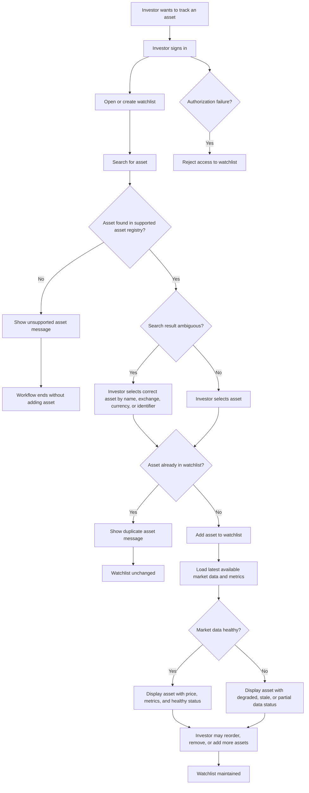
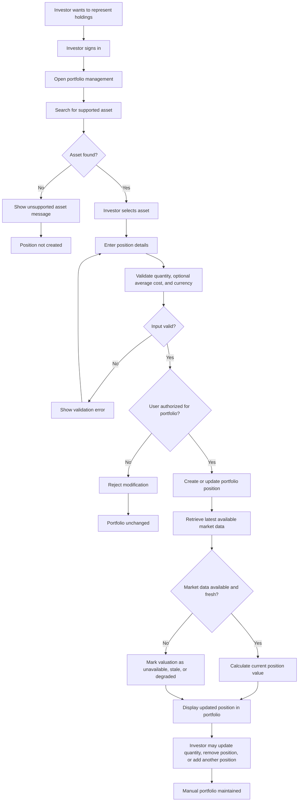
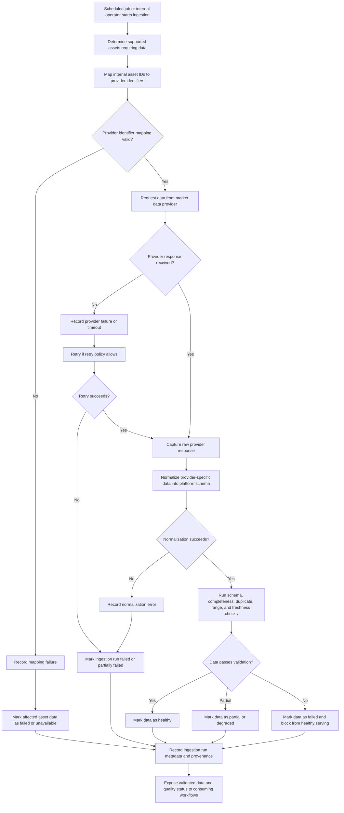
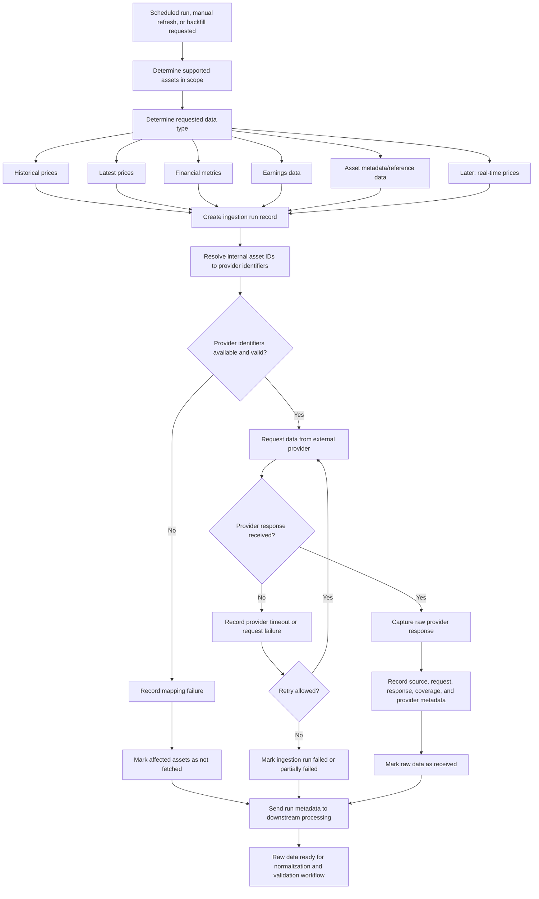
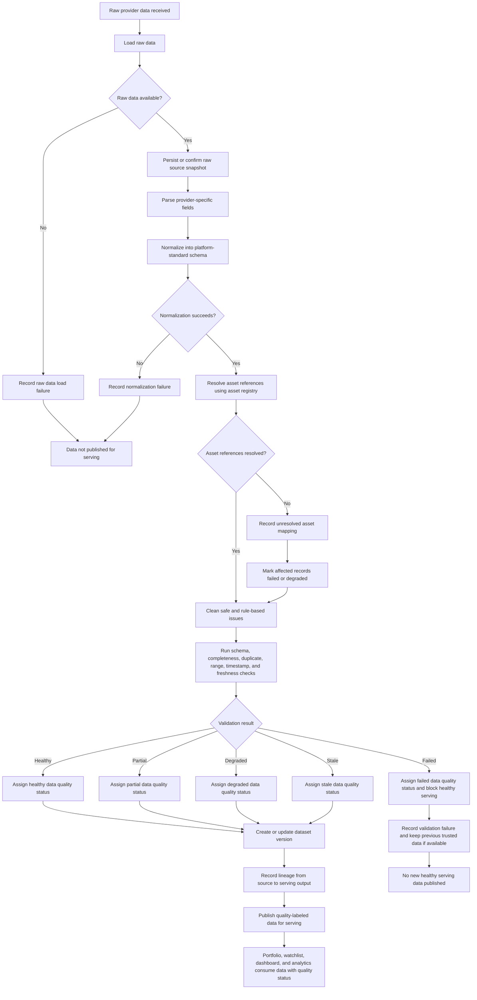
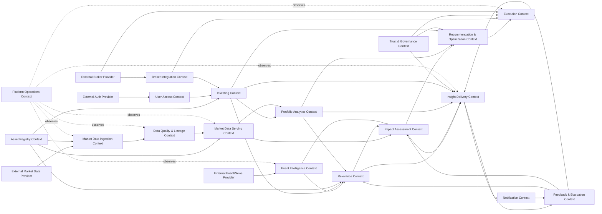

# ADR 0003: Strategic Domain-Driven Design for Market Intelligence Platform

| Metadata          | Value                                                 |
| ----------------- | ----------------------------------------------------- |
| **Date**          | 2026-04-30                                            |
| **Author**        | @barto-official                                       |
| **Status**        | `Proposed`                                            |
| **Tags**          | architecture, ddd, strategic-design, bounded-contexts |
| **Related**       | `docs/architecture/adr/0002-system-context.md`        |
| **Supersedes**    | N/A                                                   |
| **Superseded by** | N/A                                               |

# Background

## 1) Decision & Design

### Decision Statement

We adopt Strategic Domain-Driven Design (DDD) as the architecture framing for the Market Intelligence Platform. We will define bounded contexts around business capabilities, maintain a ubiquitous language across product and engineering, and use explicit context mapping to control dependencies between ingestion, investor context, and intelligence workflows. This gives us a stable domain backbone for incremental delivery now and safer expansion later.

### Decision Details

- We will define and maintain explicit bounded contexts before deep service decomposition.
- We will establish and enforce a ubiquitous language for trust-critical and workflow-critical domain terms.
- We will isolate external provider models behind anti-corruption boundaries.
- We will separate market data ingestion/validation concerns from investor-context management concerns.
- We will make freshness, quality, and provenance first-class domain concepts in contracts and models.

### Decision Scope

- **In scope:** Strategic domain decomposition, context ownership boundaries, ubiquitous language, and context mapping.
- **Out of scope:** Final infrastructure topology, vendor/tool selection, and detailed UI behavior.
- **Assumptions:** Phase-one delivery focuses on trusted market data + investor context (watchlist/portfolio) foundations.
- **Non-goals:** Broker execution, guaranteed outcomes, autonomous investing actions, or institutional-terminal parity.

### Affected Architecture Views

- `docs/architecture/adr/0002-system-context.md`

### Why this option

Strategic DDD is the best fit because the platform’s complexity comes from business meaning, trust semantics, and evolving decision support rather than from raw throughput alone. A purely technical decomposition would optimize local implementation speed but increase long-term ambiguity and cross-team friction. DDD gives a durable model for aligning product intent, data quality guarantees, and implementation ownership, which is essential in a domain where inaccurate semantics can directly damage user trust.

## 2) Options Considered

### Option A: Strategic DDD with bounded contexts (chosen)

- **Summary:** Start from business capabilities and domain language, then align service/API boundaries to those contexts.
- **Pros:**
  - Strong semantic consistency across teams and artifacts.
  - Better ownership clarity and safer parallel development.
  - Better handling of trust-critical concerns (freshness, quality, provenance).
- **Cons / Risks:**
  - Higher initial modeling overhead.
  - Requires continuous governance to keep boundaries useful.
- **Operational Impact:** Clearer incident ownership and boundary-aware runbooks.
- **Cost Impact:** Higher short-term architecture cost, lower medium/long-term refactor cost.
- **Notes:** Best aligned with an evolving, trust-sensitive product domain.

### Option B: Technical decomposition first

- **Summary:** Decompose quickly by technical layers/services and refine domain meaning later.
- **Pros:**
  - Fast initial delivery.
  - Lower up-front architecture ceremony.
- **Cons / Risks:**
  - Higher semantic drift and duplicated rules.
  - Harder to evolve toward explainable portfolio-aware intelligence.
- **Operational Impact:** Faster start, weaker long-term ownership clarity.
- **Cost Impact:** Lower initial cost, likely higher future rework cost.

### Option C: Data-platform-first optimization

- **Summary:** Prioritize ingestion/analytics platform architecture first; domain boundaries emerge later.
- **Pros:**
  - Strong data pipeline posture early.
  - Useful for exploration and broad ingestion scale.
- **Cons / Risks:**
  - Product semantics and user-context boundaries become secondary.
  - Greater risk of provider schema leakage into product behavior.
- **Operational Impact:** Good data ops, weaker product-domain cohesion.
- **Cost Impact:** Significant early platform investment with uncertain product-alignment payoff.

## 3) Consequences

### Positive Consequences

- Shared domain language improves communication and implementation consistency.
- Bounded contexts reduce accidental coupling and improve maintainability.
- Trust signals become explicit and testable across workflows.
- Future intelligence capabilities can build on stable foundations.

### Negative Consequences / New Risks

- More up-front architecture effort before implementation details.
- Risk of over-modeling if governance is too rigid.
- Need for ongoing maintenance of context maps and glossary.

### Impact on Quality Attributes

- **Performance:** Neutral to slightly negative short-term, with better long-term optimization leverage.
- **Reliability/Availability:** Improved fault isolation and clearer degradation behavior.
- **Security:** Improved boundary control and clearer ownership of sensitive flows.
- **Maintainability/Evolvability:** Strong positive due to reduced semantic coupling.
- **Cost:** Short-term increase, long-term reduction in rework/coordination overhead.

## 4) Implementation Plan (Decision-to-Action)

### High-level Plan

1. Define initial bounded contexts and their responsibilities for phase-one scope.
1. Publish and adopt ubiquitous language across docs, APIs, and schema naming.
1. Introduce context contracts carrying freshness, quality, and provenance semantics.
1. Align backlog ownership and acceptance criteria to context boundaries.
1. Validate boundaries against the business workflows captured in this ADR.

## 5) Revisit Triggers

This decision should be revisited if any of the following occur:

- Repeated incidents reveal persistent ambiguity in context ownership.
- The context map no longer matches product behavior and causes duplicated business rules.
- Product scope expands into advanced recommendation or autonomous actions requiring new compliance/safety constraints.
- Team topology changes and current context ownership becomes impractical.
- Provider landscape changes force major anti-corruption redesign.
- Cost/performance constraints require significant context consolidation or re-segmentation.

______________________________________________________________________

# Background

## Domain

### Description

The Market Intelligence Platform domain concerns retail investor market intelligence: helping active investors maintain their investing context, monitor relevant market data, and progressively translate market, news, macro, and geopolitical events into portfolio-aware, risk-aware understanding.

The primary users are active retail investors and, later, small professional investors or independent advisors who manage portfolios or watchlists, follow market developments regularly, and need faster sensemaking than fragmented broker apps, news feeds, social media, charts, and spreadsheets provide.

Users need to know which assets they care about, what is happening in the market, which information is relevant to their holdings or watchlists, whether the data is trustworthy and fresh, and eventually how events may affect their portfolio through clear mechanisms, confidence levels, evidence, and uncertainty.

The platform manages the user’s investing context, including accounts, watchlists, manually entered portfolio positions, supported assets, asset metadata, market prices, financial metrics, data freshness, quality status, source provenance, and later event records, relevance mappings, explanations, feedback, and evaluation history.

The platform helps users reduce attention waste and decision uncertainty by consolidating market context, showing relevant asset and portfolio information in one place, surfacing trustworthy market data with freshness and quality signals, and eventually transforming raw events into portfolio-aware insights rather than opaque trading instructions.

The main difficulty is that financial information is fragmented, time-sensitive, noisy, provider-dependent, and trust-critical. Incorrect identifiers, stale prices, weak provenance, misleading explanations, or overconfident impact claims can directly damage user trust and may create compliance or safety risk.

The full scope of the implementation includes ingestion of market and financial data (historical and real-time), data quality and cleaning, data analytics through dashboard, application with user account, portfolio and watchlist management, ingestion of news,earnings, macro, regulatory, and geopolitical event ingestion, impact assessment of geopolitics on market, and trade recommendations.

The domain explicitly excludes broker-dealer functionality, guaranteed-return positioning, HFT infrastructure, full institutional-terminal replacement, complete multi-asset/global coverage from day one, complex derivatives automation, tax-lot accounting, unrestricted autonomous investing, and any workflow that implies regulated financial advice before the required product, compliance, safety, and trust gates are satisfied.

### Capabilities

1. User, access, consent, and personalization management — Manage user accounts, authentication, authorization, sessions, preferences, activity tracking, consent, and future personalization boundaries.
1. Investing context management — Allow users to create and maintain watchlists, manual portfolios, positions, investing preferences, and later broker-synced holdings or paper portfolios.
1. Asset and instrument identity management — Maintain supported assets, symbols, exchanges, asset metadata, provider identifier mappings, asset classifications.
1. Market and financial data acquisition — Acquire historical prices, latest prices, financial metrics, earnings data, asset metadata, and later real-time market data across supported asset classes.
1. Data quality, normalization, lineage, and governance — Normalize provider data into platform schemas, validate completeness/freshness/ranges/duplicates, track ingestion runs, create dataset versions, record lineage, and expose data quality status.
1. Market data serving and investment analytics — Publish trusted market data for product use, serve prices and metrics to dashboards, calculate position valuation, portfolio valuation, exposure, performance, and risk summaries.
1. Market intelligence — Ingest, classify, normalize, and enrich external events, including news, earnings, macro, regulatory, and geopolitical developments.
1. Event relevance, impact assessment, and portfolio-aware insight generation — Map events to assets, sectors, geographies, watchlists, and portfolios; assess relevance and potential impact; generate explanations, confidence levels, drivers, source evidence, and portfolio-aware narratives.
1. Notifications, feedback, evaluation, and learning loop — Create and suppress alert candidates, deliver notifications, collect relevance and data-quality feedback, track insight outcomes, evaluate calibration, analyze false positives/false negatives, and support continuous improvement.
1. Recommendations, broker integration, execution readiness, trust, and compliance governance — Support later portfolio optimization, recommendation governance, broker connection, paper trading, trade-intent workflows, audit trails, disclaimers, financial advice boundaries, model/version provenance, and automation eligibility gates.

### Business Workflows

#### Workflow #1: Create and Maintain Watchlist

Actors:

- Authenticated Investor
- Market Intelligence Platform
- Asset Registry
- Market Data Provider, indirectly through already-ingested data

Trigger: The investor wants to track assets they care about without entering full portfolio positions.

Main path:

1. Investor signs in.
1. Investor creates a watchlist or opens an existing watchlist.
1. Investor searches for an asset by symbol, name, exchange, or supported identifier.
1. Platform returns matching supported assets.
1. Investor selects the correct asset.
1. Platform adds the asset to the selected watchlist.
1. Platform displays the asset in the watchlist with available price, basic metrics, and freshness/quality status.
1. Investor may remove assets, reorder assets, or maintain multiple watchlists later.

Alternative paths:

- Investor adds an asset to a default watchlist without explicitly creating one.
- Investor creates multiple watchlists for different strategies or themes.
- Investor removes an asset from the watchlist.
- Platform groups assets in themes and recommends to the user a theme based on his interests.

Failure paths:

- Asset is unsupported.
- Asset search returns ambiguous symbols across exchanges.
- Asset is already in the watchlist.
- Latest market data is unavailable or stale.
- User is not authorized to modify the watchlist.
- Provider identifier mapping is missing or inconsistent.

Business outcome: The investor has a maintained list of relevant assets that can be used for recurring market checks and future personalized insights.

#### Workflow: Create and Maintain Manual Portfolio

Actors:

- Authenticated Investor
- Market Intelligence Platform
- Asset Registry
- Market Data Foundation

Trigger: The investor wants to represent their actual or simulated holdings inside the platform.

Main path:

1. Investor opens portfolio management.
1. Investor searches for a supported asset.
1. Investor selects the correct asset.
1. Investor enters position details such as quantity and, optionally, average cost.
1. Platform validates the position input.
1. Platform records or updates the portfolio position.
1. Platform calculates basic current position value using available market data.
1. Platform shows the position in the portfolio view with freshness and quality status.

Alternative paths:

- Investor updates quantity after buying or selling outside the platform.
- Investor removes a position.
- Investor enters only quantity and skips average cost.
- Investor maintains a manual paper portfolio rather than real holdings.
- Investor creates a portfolio from watchlist items.

Failure paths:

- Asset is unsupported.
- Quantity is invalid.
- Average cost is invalid or incompatible with the asset currency.
- Latest price is missing, stale, or degraded.
- User attempts to modify another user’s portfolio.
- Corporate action or symbol change makes the position difficult to interpret.

Business outcome: The investor has a user-owned portfolio context that can support valuation, monitoring, and future portfolio-aware intelligence.

**Workflow: Check Portfolio/Watchlist Market Position**

Actors:

- Authenticated Investor
- Market Intelligence Platform
- Portfolio/Watchlist Context
- Market Data Foundation
- Data Quality/Freshness Process

Trigger: The investor opens the platform to understand the current state of assets they care about.

Main path:

1. Investor signs in and opens the dashboard, portfolio view, or watchlist view.
1. Platform loads the investor’s watchlists and/or portfolio positions.
1. Platform retrieves latest available validated market data and selected financial metrics for the relevant assets.
1. Platform calculates basic derived values, such as current position value and simple gain/loss where supported.
1. Platform displays assets, positions, prices, metrics, and freshness/quality indicators.
1. Investor reviews the current state and decides whether further investigation is needed.
1. Investor may open an asset detail view, update a position, add/remove assets, or report a data issue.

Alternative paths:

- Investor checks only watchlist, not portfolio.
- Investor checks only asset detail view.
- Platform shows partial data with explicit quality/freshness indicators.
- Investor uses the dashboard as a quick daily check-in rather than a deep analysis view.

Failure paths:

- Portfolio/watchlist cannot be loaded.
- Market data is stale, missing, or degraded.
- Position valuation cannot be calculated.
- Asset metadata is incomplete.
- User sees incorrect or confusing data and reports an issue.
- Authorization failure prevents access to user-owned investing context.

Business outcome: The investor can quickly understand the current market state of assets they care about, with enough trust signals to know whether the displayed information is fresh, complete, and reliable.

#### Workflow: Ingest Market and Financial Data

**Actors:**

- Market Intelligence Platform
- Scheduled Job / Internal Operator
- External Market Data Provider
- Asset Registry
- Ingestion Run Tracker

**Trigger:**
A scheduled ingestion run, manual refresh, or backfill request requires the platform to fetch market or financial data for supported assets.

**Data types covered in this workflow:**

- Historical prices
- Latest prices
- Financial metrics
- Earnings data
- Asset metadata or reference data
- Later: real-time price data

**Main path:**

1. Platform determines which supported assets require data.
1. Platform determines the ingestion type: historical price, latest price, financial metrics, earnings, metadata, or later real-time data.
1. Platform creates an ingestion run record with scope, provider, requested data type, and execution timestamp.
1. Platform resolves internal asset IDs to provider-specific identifiers.
1. Platform sends the data request to the selected external provider.
1. Provider returns the requested data.
1. Platform captures the raw provider response or source snapshot.
1. Platform records provider metadata such as source, request timestamp, response timestamp, provider status, and data coverage.
1. Platform marks the ingestion request as received for downstream processing.
1. Platform passes the raw received data to the data processing, normalization, and validation workflow.

**Alternative paths:**

- Platform fetches historical data for a date range instead of latest data.
- Platform fetches metrics or earnings data instead of prices.
- Platform performs a manual backfill for missing or corrected data.
- Platform partially succeeds for some assets and fails for others.
- Platform skips inactive, unsupported, or unmapped assets.
- Platform retries transient provider failures.
- Platform receives a provider response with incomplete data coverage.

**Failure paths:**

- Provider is unavailable.
- Provider request times out.
- Provider rate limit is exceeded.
- Provider credentials are invalid.
- Provider identifier mapping is missing.
- Provider identifier mapping is incorrect.
- Requested asset is unsupported.
- Provider returns unexpected or empty data.
- Ingestion run fails before raw data is captured.

**Business outcome:**
The platform has captured raw provider data and ingestion metadata for supported market and financial data types, ready for normalization, validation, lineage tracking, and eventual serving.

#### Workflow: Normalize, Clean, Validate, and Publish Market Data

**Actors:**

- Market Intelligence Platform
- Data Processing Pipeline
- Data Quality Process
- Asset Registry
- Market Data Store
- Data Registry / Lineage Store
- Portfolio, Watchlist, Dashboard, and Analytics consumers

**Trigger:**
Raw provider data has been received from an ingestion workflow and needs to be transformed into trusted market data.

**Data types covered in this workflow:**

- Raw historical price data
- Raw latest price data
- Raw financial metrics
- Raw earnings data
- Raw asset metadata/reference data
- Later: raw real-time price messages

**Main path:**

1. Platform loads raw provider data from the ingestion output.
1. Platform records or confirms raw data persistence for replay and auditability.
1. Platform parses provider-specific fields.
1. Platform normalizes raw data into platform-standard schemas.
1. Platform resolves asset references against the internal asset registry.
1. Platform cleans data where safe and rule-based, such as formatting, type coercion, timestamp normalization, currency normalization where supported, and duplicate removal.
1. Platform validates schema, required fields, completeness, duplicate records, value ranges, timestamp consistency, and freshness.
1. Platform assigns a data quality status such as healthy, partial, degraded, stale, or failed.
1. Platform creates or updates dataset version metadata.
1. Platform records lineage from provider source to raw data, normalized data, validation results, and serving-ready output.
1. Platform publishes only valid or explicitly quality-labeled data for serving.
1. Portfolio, watchlist, dashboard, and analytics workflows consume the serving-ready data and its quality/freshness status.

**Alternative paths:**

- Data passes all checks and is marked healthy.
- Data is usable but incomplete and is marked partial.
- Data is available but stale and is marked stale.
- Data contains non-critical issues and is marked degraded.
- Data fails validation and is blocked from healthy serving.
- Some assets pass validation while others fail.
- Previously served data remains active while new data is rejected.
- A dataset is regenerated through replay or backfill.

**Failure paths:**

- Raw data cannot be loaded.
- Provider schema changed unexpectedly.
- Normalization fails.
- Asset reference cannot be resolved.
- Required fields are missing.
- Duplicate records cannot be safely resolved.
- Data contains impossible values, such as negative prices.
- Data is stale beyond the allowed threshold.
- Dataset version cannot be created.
- Lineage cannot be recorded.
- No trustworthy data is available for serving.

**Business outcome:**
The platform has trusted, normalized, traceable, and quality-labeled market data that can safely power watchlists, portfolios, dashboards, analytics, and future insight-generation workflows.

### Pain Points

**Pain point: Ambiguous asset identity**

- Workflow: Create and Maintain Watchlist; Create and Maintain Manual Portfolio
- Description: The same ticker symbol may refer to different instruments across exchanges, providers, or asset classes.
- Why it matters: Users may add or value the wrong asset.
- Possible consequence: Loss of trust, incorrect portfolio valuation, incorrect future insights.
- DDD implication: Asset, Symbol, Exchange, ProviderIdentifier, and SupportedAsset need precise language and ownership.

**Pain point: Stale or degraded market data may look trustworthy**

- Workflow: Check Portfolio/Watchlist Market Position
- Description: Users may assume displayed prices and metrics are current unless freshness and quality status are explicit.
- Why it matters: Investment decisions are time-sensitive.
- Possible consequence: User acts on outdated or incomplete information.
- DDD implication: Freshness, QualityStatus, and DataProvenance should be explicit domain concepts.

**Pain point: Provider schema or identifier changes can break ingestion**

- Workflow: Ingest, Normalize, and Validate Market Data
- Description: External provider data formats, symbols, fields, or semantics may change.
- Why it matters: Data pipelines can fail silently or produce incorrect normalized data.
- Possible consequence: Incorrect data served to users.
- DDD implication: RawProviderResponse, NormalizedMarketData, IngestionRun, and ValidationResult should be explicit concepts.

**Pain point: Users need confidence without receiving financial advice**

- Workflow: Check Portfolio/Watchlist Market Position; future insight workflows
- Description: The platform must help users understand market context without implying guaranteed outcomes or regulated advice.
- Why it matters: Finance is trust-critical and compliance-sensitive.
- Possible consequence: Regulatory, reputational, and user-trust risk.
- DDD implication: Separate information, insight, recommendation, and action concepts carefully.

### Actors

- Authenticated Investor
- Admin
- Scheduled Ingestion Job
- Market Data Provider
- Market Intelligence Platform
- Authorization Mechanism
- Broker
- Notification System

### Commands

- CreateWatchlist

- RenameWatchlist

- DeleteWatchlist

- AddAssetToWatchlist

- RemoveAssetFromWatchlist

- CreatePortfolio

- RenamePortfolio

- DeletePortfolio

- AddPosition

- UpdatePosition

- RemovePosition

- RunMarketDataIngestion

- RunHistoricalBackfill

- ResolveProviderIdentifiers

- RequestProviderMarketData

- CaptureRawMarketData

- NormalizeMarketData

- ValidateMarketData

- CalculateFreshnessStatus

- PublishMarketDataForServing

- CalculatePortfolioValuation

- ReportDataIssue

- StartDataIssueTriage

- ResolveDataIssue

### Queries

- SearchAsset
- ViewDashboard
- ViewPortfolio
- ViewWatchlist
- ViewAssetDetail
- GetPortfolioMarketPosition
- GetWatchlistMarketPosition
- GetAssetMarketData
- GetIngestionRunStatus
- GetMarketDataQualityView

### Events

#### Domain events

- WatchlistCreated

- WatchlistRenamed

- WatchlistDeleted

- AssetAddedToWatchlist

- AssetRemovedFromWatchlist

- WatchlistAssetAdditionRejected

- PortfolioCreated

- PortfolioRenamed

- PortfolioDeleted

- PositionAdded

- PositionUpdated

- PositionRemoved

- PositionEntryRejected

- MarketDataMarkedHealthy

- MarketDataMarkedDegraded

- MarketDataMarkedStale

- MarketDataPublishedForServing

- PortfolioValuationCalculated

- PortfolioValuationPartiallyCalculated

- PortfolioValuationFailed

- DataIssueReported

- DataIssueTriageStarted

- DataIssueResolved

#### Ingestion/process events

- MarketDataIngestionStarted
- HistoricalBackfillStarted
- ProviderIdentifiersResolved
- ProviderIdentifierResolutionFailed
- MarketDataRequested
- MarketDataReceived
- MarketDataRequestFailed
- RawMarketDataCaptured
- MarketDataNormalized
- MarketDataNormalizationFailed
- MarketDataValidated
- MarketDataValidationFailed
- MarketDataIngestionCompleted
- MarketDataIngestionPartiallyCompleted
- MarketDataIngestionFailed

#### Query/product usage events

- AssetSearchPerformed
- AssetSearchReturned
- DashboardViewed
- PortfolioViewed
- WatchlistViewed
- AssetDetailViewed
- PortfolioMarketPositionDisplayed
- MarketPositionDisplayedWithDegradedData

### Policies

**Access & Ownership**

- User-owned investing context access policy
- Administrative override access policy (future)

**Asset Identity & Eligibility**

- Supported asset policy
- Internal asset identity policy
- Asset identity disambiguation policy
- Duplicate asset prevention policy (watchlist)
- Duplicate position policy (portfolio)

**Portfolio & Position**

- Position quantity validation policy
- Cost basis handling policy
- Manual portfolio accuracy policy
- Currency handling policy
- Partial valuation policy

**Market Data Ingestion**

- Provider identifier resolution policy
- Retry policy
- Raw data capture policy
- Ingestion completeness policy

**Data Normalization & Validation**

- Data normalization policy
- Data validation policy
- Data rejection policy

**Data Quality & Freshness**

- Quality status policy
- Freshness policy
- Previous trusted data fallback policy

**Data Serving**

- Publish only validated data policy
- Serving eligibility policy
- Partial data serving policy

**Trust, Transparency & UX**

- Trust signal display policy
- Facts vs analytics distinction policy

### Read Models

- Watchlist Overview
- Watchlist Detail
- Asset Search Result
- Portfolio Overview
- Portfolio Position List
- Position Detail
- Ingestion Run Status
- Market Data Quality View
- Asset Market Data View
- Provider Mapping View
- Dashboard View
- Portfolio Market Position View
- Watchlist Market Position View
- Asset Detail View
- Data Issue Submission View
- Data Issue Triage View
- Market Data Freshness View
- Portfolio Valuation Status View

### Pain Points

- **User pain**

  - Unsupported assets
  - Dashboard may blur facts and insights
  - Ambiguous asset identity
  - Manual portfolio drift

- **Data correctness pain**

  - Provider identifier mismatch
  - Provider schema changes
  - Partial ingestion success
  - Stale but technically successful data
  - Previous data overwritten by bad provider response

- **Financial modeling pain**

  - Cost basis complexity
  - Corporate actions
  - Currency mismatch
  - Portfolio valuation may be incomplete

- **Trust/compliance pain**

  - User may overtrust degraded data
  - User feedback may lack diagnostic context

### Business Rules

| ID     | Rule                                                                                | Applies To                           | Reason                                                   | Exception                         |
| ------ | ----------------------------------------------------------------------------------- | ------------------------------------ | -------------------------------------------------------- | --------------------------------- |
| BR-001 | A user can only access their own investing context.                                 | Watchlists, portfolios, positions    | Financial context is private.                            | Future admin/support access.      |
| BR-002 | Only supported assets can be added to watchlists or portfolios.                     | Watchlist, portfolio                 | Reliable data requires supported assets.                 | Future requested/custom assets.   |
| BR-003 | Platform assets must have stable internal identities.                               | Asset registry, ingestion, portfolio | Symbols and provider IDs are ambiguous.                  | None.                             |
| BR-004 | Provider identifiers must map unambiguously before data can be attached.            | Ingestion                            | Prevent wrong data association.                          | Ambiguous mappings go to review.  |
| BR-005 | A watchlist asset is not a portfolio position.                                      | Watchlist, portfolio                 | Tracking and ownership differ.                           | None.                             |
| BR-006 | A manual portfolio position is user-maintained, not broker-verified.                | Portfolio                            | Manual state can drift.                                  | Future broker sync.               |
| BR-007 | Position quantity must be valid for the supported position model.                   | Portfolio                            | Invalid quantity creates invalid valuation.              | Future short positions.           |
| BR-008 | Average cost is optional unless P&L is shown.                                       | Portfolio                            | Reduce friction and avoid misleading P&L.                | P&L requires cost basis.          |
| BR-009 | Raw provider responses should be captured before normalization when feasible.       | Ingestion                            | Auditability and replay.                                 | Licensing restrictions.           |
| BR-010 | Provider data must be normalized before product-facing use.                         | Market data serving                  | Prevent provider schema leakage.                         | Internal diagnostics.             |
| BR-011 | Market data must pass validation or be explicitly marked degraded before serving.   | Market data serving                  | Avoid silent wrong outputs.                              | Internal/admin diagnostics.       |
| BR-012 | Technical ingestion success does not imply business data quality.                   | Ingestion, quality                   | Data may be stale/incomplete despite successful request. | None.                             |
| BR-013 | Freshness must be tracked separately from validity.                                 | Data quality                         | Valid data may be stale.                                 | Historical data semantics differ. |
| BR-014 | Impossible or suspicious values must not be served as healthy data.                 | Validation                           | Prevent misleading outputs.                              | Field-specific semantics.         |
| BR-015 | Partial ingestion success must be represented explicitly.                           | Ingestion, views                     | Avoid hiding missing data.                               | None.                             |
| BR-016 | Portfolio valuation must distinguish complete, partial, and failed valuation.       | Portfolio view                       | Avoid misleading total value.                            | None.                             |
| BR-017 | Portfolio valuation must not silently ignore failed positions.                      | Portfolio view                       | Excluding failed positions distorts value.               | Explicit user filtering.          |
| BR-018 | User-facing degraded data must show quality/freshness status.                       | UI/read models                       | Trust requires visible uncertainty.                      | None.                             |
| BR-019 | Reporting a data issue does not immediately change market data.                     | Feedback, data quality               | Reports require validation.                              | Severe confirmed incident.        |
| BR-020 | Raw market data, calculated valuation, and future insights must be distinguishable. | Dashboard, future insights           | Avoid confusing facts with advice.                       | None.                             |

### Exceptions

| ID     | Failure Case                    | Workflow                 | Detection                       | Expected Handling                  | Event / Outcome                                        |
| ------ | ------------------------------- | ------------------------ | ------------------------------- | ---------------------------------- | ------------------------------------------------------ |
| FC-001 | Unsupported asset               | Watchlist, Portfolio     | Asset not in supported registry | Reject add/create action           | WatchlistAssetAdditionRejected / PositionEntryRejected |
| FC-002 | Ambiguous asset identifier      | Watchlist, Portfolio     | Multiple matching assets        | Require disambiguation             | AssetSearchResultsReturned / Addition rejected         |
| FC-003 | Duplicate watchlist asset       | Watchlist                | Same asset_id already present   | Reject or no-op                    | WatchlistAssetAdditionRejected                         |
| FC-004 | Unauthorized access             | All user-owned contexts  | user_id mismatch                | Reject and audit                   | AccessDenied                                           |
| FC-005 | Invalid quantity                | Portfolio                | Quantity validation fails       | Reject position command            | PositionEntryRejected                                  |
| FC-006 | Invalid average cost            | Portfolio                | Cost validation fails           | Reject or allow without cost       | PositionEntryRejected / PositionAdded                  |
| FC-007 | Duplicate portfolio position    | Portfolio                | Position for same asset exists  | Reject or route to update          | PositionEntryRejected / PositionUpdated                |
| FC-008 | Provider unavailable            | Market data ingestion    | Timeout/5xx/network error       | Retry, then mark failed/partial    | MarketDataRequestFailed                                |
| FC-009 | Provider rate limit exceeded    | Market data ingestion    | 429/quota response              | Delay/stop requests                | MarketDataIngestionPartiallyCompleted                  |
| FC-010 | Missing provider mapping        | Market data ingestion    | No provider identifier          | Skip asset, record failure         | ProviderIdentifierResolutionFailed                     |
| FC-011 | Ambiguous provider mapping      | Market data ingestion    | Multiple mappings               | Block attachment, manual review    | ProviderIdentifierResolutionFailed                     |
| FC-012 | Provider schema changed         | Market data ingestion    | Normalization/schema failure    | Block publish, alert               | MarketDataNormalizationFailed                          |
| FC-013 | Invalid market data value       | Market data validation   | Sanity/range check fails        | Mark failed/degraded               | MarketDataValidationFailed                             |
| FC-014 | Stale provider data             | Market data validation   | Freshness check fails           | Mark stale/degraded                | MarketDataMarkedStale                                  |
| FC-015 | Partial ingestion success       | Market data ingestion    | Mixed result summary            | Publish valid data, mark failures  | MarketDataIngestionPartiallyCompleted                  |
| FC-016 | Duplicate ingestion records     | Market data ingestion    | Idempotency/unique check        | Ignore/update idempotently         | DuplicateMarketDataDetected                            |
| FC-017 | Investing context not found     | Dashboard/view           | No portfolio/watchlist          | Show empty state                   | MarketPositionDisplayUnavailable                       |
| FC-018 | Market data missing             | Portfolio/watchlist view | No usable data                  | Show unavailable/degraded state    | MarketPositionDisplayDegraded                          |
| FC-019 | Portfolio valuation failed      | Portfolio view           | No calculable positions         | Show valuation unavailable         | PortfolioValuationFailed                               |
| FC-020 | Portfolio valuation partial     | Portfolio view           | Some positions unvalued         | Show partial valuation             | PortfolioValuationPartiallyCalculated                  |
| FC-021 | Currency conversion unsupported | Portfolio view           | Currency mismatch               | Mark valuation partial/unavailable | PortfolioValuationPartiallyCalculated                  |
| FC-022 | User reports data issue         | Portfolio/watchlist view | User report                     | Create issue, do not mutate data   | DataIssueReported                                      |
| FC-023 | Unknown data quality status     | Market data serving      | Missing quality metadata        | Treat as degraded/unavailable      | MarketPositionDisplayDegraded                          |
| FC-024 | Raw storage restricted          | Ingestion/provenance     | Provider license restriction    | Store allowed provenance metadata  | ProvenanceCapturedPartially                            |

Severity 1: Must block operation

- Unauthorized access
- Ambiguous provider mapping
- Invalid market data value
- Provider schema change
- Unsupported asset for portfolio/watchlist in V1

Severity 2: Can proceed with degraded output

- Stale market data
- Missing metrics
- Partial ingestion
- Partial portfolio valuation

Severity 3: User/product friction

- Duplicate watchlist asset
- Empty investing context
- Unsupported asset search demand
- Invalid form input

Severity 4: Operational/compliance concern

- Provider rate limit
- Raw storage restricted
- Corporate action unsupported

### Glossary

| Term                | Meaning                                                              | Context               | Avoid Confusing With         |
| ------------------- | -------------------------------------------------------------------- | --------------------- | ---------------------------- |
| Investor            | User who maintains investing context and monitors market information | Product               | Broker, professional advisor |
| Asset               | Stable internal representation of a financial instrument             | Asset Universe        | Symbol, Position             |
| Supported Asset     | Asset covered by the platform for tracking/data                      | Asset Universe        | Any real-world asset         |
| Symbol              | Human-readable ticker/display identifier                             | Search/UI             | Asset identity               |
| Provider Identifier | External vendor’s identifier for an asset                            | Market Data           | Internal asset_id            |
| Watchlist           | User-owned list of assets to monitor                                 | Portfolio & Watchlist | Portfolio                    |
| Watchlist Item      | Association between watchlist and asset                              | Portfolio & Watchlist | Position                     |
| Portfolio           | User-owned collection of positions                                   | Portfolio & Watchlist | Watchlist                    |
| Position            | User-maintained holding record for an asset                          | Portfolio & Watchlist | Asset, Trade                 |
| Quantity            | Amount of asset in a position                                        | Portfolio             | Price, Value                 |
| Average Cost        | Optional user-provided average acquisition cost                      | Portfolio             | Verified cost basis          |
| Current Value       | Calculated position value using price and quantity                   | Portfolio Valuation   | Raw market data              |
| Market Data         | Provider-supplied asset prices/metrics                               | Market Data           | Portfolio data, insight      |
| Latest Price        | Most recent available validated price                                | Market Data           | Real-time price              |
| Financial Metric    | Selected metric such as market cap/P/E/P/S                           | Market Data           | Portfolio metric             |
| Quality Status      | Health state of data/output                                          | Data Quality          | Freshness only               |
| Freshness Status    | Recency state of data                                                | Data Quality          | Validity                     |
| Ingestion Run       | One execution of data ingestion                                      | Market Data           | Dataset                      |
| Provenance          | Evidence of source and transformation history                        | Data Governance       | Logging only                 |
| Data Issue          | Reported or detected data correctness problem                        | Feedback              | Confirmed defect             |
| Domain Event        | Meaningful fact inside platform/domain workflow                      | DDD                   | Market Event                 |
| Market Event        | External event that may affect markets/assets                        | Future Intelligence   | Domain Event                 |
| Insight             | Explanation of why something may matter                              | Future Intelligence   | Recommendation               |
| Recommendation      | Suggested action/configuration                                       | Future Automation     | Insight                      |

## Subdomains

| Subdomain                                 | Description                                                                                                  | Business importance  | Complexity  | Change frequency | Differentiating value  | Current pain                                                                | Classification                   |
| ----------------------------------------- | ------------------------------------------------------------------------------------------------------------ | -------------------- | ----------- | ---------------- | ---------------------- | --------------------------------------------------------------------------- | -------------------------------- |
| Event-to-Asset Relevance                  | Determines whether external events are relevant to assets, sectors, geographies, watchlists, and portfolios. | Very High            | High        | High             | Very High              | Noisy signals, weak relevance, mapping errors reduce trust.                 | Core Domain                      |
| Impact Assessment                         | Estimates direction, magnitude, confidence, and time horizon of event impact on assets.                      | Very High            | High        | High             | Very High              | Misleading or oversimplified impact; lack of explainability.                | Core Domain                      |
| Insight Generation & Explanation          | Produces user-facing insights with explanations, evidence, and uncertainty grounded in portfolio context.    | Very High            | High        | High             | Very High              | Opaque insights, risk of overconfidence, poor separation from raw data.     | Core Domain                      |
| Feedback & Evaluation Loop                | Captures feedback, evaluates correctness and calibration, and improves models and insights.                  | High                 | High        | High             | High (long-term)       | Feedback lacks context; weak evaluation loop.                               | Core-enabling Subdomain          |
| Event Understanding                       | Classifies and enriches events (entity extraction, tagging, severity, mapping).                              | High                 | High        | High             | Medium–High            | Unstructured data, inconsistent classification, entity ambiguity.           | Core-enabling Subdomain          |
| Portfolio Analytics                       | Calculates valuation, exposure, performance, and basic risk metrics.                                         | High                 | Medium–High | Medium           | Medium                 | Partial valuation, currency mismatch, cost basis issues.                    | Supporting (core-enabling later) |
| Investing Context (Watchlist & Portfolio) | Manages user-owned watchlists, portfolios, positions, and preferences.                                       | High                 | Medium      | Medium           | Medium                 | Manual drift, identity ambiguity, confusion between watchlist vs portfolio. | Supporting Subdomain             |
| Market Data Serving                       | Provides validated, quality-labeled market data for product use.                                             | High                 | Medium      | Medium           | Low–Medium             | Incorrect trust signals, stale/degraded data presentation.                  | Supporting Subdomain             |
| Data Quality, Lineage & Governance        | Ensures correctness, traceability, versioning, and trustworthiness of data.                                  | Very High            | High        | Medium–High      | Indirect but critical  | Silent failures, lack of provenance, debugging difficulty.                  | Supporting (strategic)           |
| Market Data Ingestion                     | Acquires market and financial data from providers.                                                           | High                 | Medium–High | Medium           | Low                    | Provider failures, schema changes, partial ingestion.                       | Supporting Subdomain             |
| Asset Registry & Identity                 | Maintains supported assets, identifiers, mappings, and metadata.                                             | High                 | Medium      | Low–Medium       | Low–Medium (high risk) | Ambiguous symbols, incorrect mappings, identity inconsistency.              | Supporting Subdomain             |
| Notification & Alerting                   | Generates and delivers alerts based on data, events, or insights.                                            | Medium               | Medium      | Medium           | Low–Medium             | Alert fatigue, low signal-to-noise ratio.                                   | Generic / Supporting             |
| Recommendation & Optimization             | Produces portfolio suggestions and optimization strategies.                                                  | High (future)        | High        | High             | High                   | Requires strong trust, explainability, compliance.                          | Core Domain (future)             |
| Broker Integration                        | Connects to brokers and syncs holdings/transactions.                                                         | Medium               | Medium      | Low–Medium       | Low                    | Integration variability, reconciliation complexity, security.               | Generic / Supporting             |
| Trading / Execution                       | Handles trade intents, order submission, and execution tracking.                                             | Medium–High (future) | High        | Medium           | Low–Medium             | Regulatory risk, correctness requirements.                                  | Supporting / Regulated           |
| User & Access Management                  | Manages authentication, authorization, and identity.                                                         | Medium               | Low         | Low              | Low                    | Security integration complexity.                                            | Generic Subdomain                |
| Operations & Platform Engineering         | Handles deployment, monitoring, logging, and system operations.                                              | Medium               | Medium      | Medium           | None                   | Cost control, reliability, observability challenges.                        | Generic Subdomain                |

### Possible Ambiguous Language Candidates

| Term                | Ambiguity                                                                                       | Recommended distinction                                                                                                         |
| ------------------- | ----------------------------------------------------------------------------------------------- | ------------------------------------------------------------------------------------------------------------------------------- |
| Asset               | Could mean security, instrument, symbol, provider object, portfolio holding, or watchlist item. | Use `Asset` for platform-supported instrument identity. Use `Position` for user holding. Use `WatchlistItem` for tracked asset. |
| Symbol / Ticker     | Same ticker may exist on multiple exchanges or providers.                                       | Treat symbol as display/search attribute, never identity.                                                                       |
| Provider Identifier | Could be mistaken for internal asset identity.                                                  | Provider ID is external mapping only; internal `asset_id` is source of truth.                                                   |
| Watchlist Asset     | Could be confused with owned holding.                                                           | Watchlist item means interest/tracking, not ownership.                                                                          |
| Portfolio Position  | Could be confused with asset itself.                                                            | Position is user-specific holding/reference to an asset plus quantity/cost data.                                                |
| Portfolio           | Could mean real holdings, paper portfolio, broker account, strategy, or view.                   | Distinguish `ManualPortfolio`, `PaperPortfolio`, `BrokerSyncedPortfolio` later.                                                 |
| Market Data         | Could mean raw provider data, normalized data, validated data, or served data.                  | Use `RawMarketData`, `NormalizedMarketData`, `ValidatedMarketData`, `ServingMarketData`.                                        |
| Latest Price        | Could mean provider latest, platform latest, or latest validated.                               | Use `LatestProviderPrice` vs `LatestValidatedPrice`.                                                                            |
| Fresh               | Could be confused with valid/correct.                                                           | Freshness is time-based; validity is quality-rule-based.                                                                        |
| Healthy             | Could mean technically ingested or business-trustworthy.                                        | Healthy means passed quality and serving eligibility checks.                                                                    |
| Degraded            | Could mean incomplete, stale, partial, or low confidence.                                       | Define explicit statuses: `partial`, `stale`, `degraded`, `failed`.                                                             |
| Event               | Could mean domain event, market news event, system event, product usage event.                  | Use `DomainEvent`, `ExternalMarketEvent`, `SystemEvent`, `UsageEvent`.                                                          |
| Insight             | Could mean raw data, analytics, explanation, recommendation, or alert.                          | Insight should mean interpreted, user-facing intelligence with evidence/uncertainty.                                            |
| Impact              | Could mean price move, causal effect, risk exposure, or user action.                            | Define impact as estimated effect with direction, magnitude, horizon, confidence, drivers.                                      |
| Recommendation      | Could imply financial advice.                                                                   | Prefer `Consideration`, `Scenario`, or `Decision Support Recommendation` until governance matures.                              |
| Alert               | Could mean notification, volatility signal, event signal, or insight.                           | Separate `NotificationCandidate`, `AlertPolicy`, and `NotificationDelivery`.                                                    |
| Valuation           | Could mean position value, portfolio value, P&L, performance, or risk.                          | Separate `PositionValuation`, `PortfolioValuation`, `Performance`, `Exposure`.                                                  |
| User                | Could mean authenticated identity, investor, admin, support operator.                           | Use `Investor`, `InternalOperator`, `SupportUser`, `AdminUser`.                                                                 |
| Data Issue          | Could mean provider error, user misunderstanding, stale data, wrong mapping, or UI confusion.   | Data issue report must include category and diagnostic context.                                                                 |
| Audit               | Could mean security logs, data lineage, model provenance, execution records.                    | Separate `AuditRecord`, `LineageRecord`, `ModelProvenance`, `ExecutionAudit`.                                                   |

### Bounded Context

| Candidate bounded context             | Purpose                                                                                  | Owned concepts                                                                                  | Main workflows                                                                    | Upstream dependencies                                                      | Downstream consumers                                           | Implementation candidate                          |
| ------------------------------------- | ---------------------------------------------------------------------------------------- | ----------------------------------------------------------------------------------------------- | --------------------------------------------------------------------------------- | -------------------------------------------------------------------------- | -------------------------------------------------------------- | ------------------------------------------------- |
| User Access Context                   | Manage identity, access, permissions, consent, and preferences.                          | User, Identity, Permission, Consent, Preference                                                 | Authenticate user, authorize access, grant/revoke consent                         | External auth provider                                                     | All user-owned contexts                                        | Use standard auth/service/module                  |
| Investing Context                     | Manage user-owned watchlists, portfolios, and positions.                                 | Watchlist, WatchlistItem, Portfolio, Position, ManualPortfolio                                  | Create watchlist, add asset, create portfolio, add/update/remove position         | User Access, Asset Registry                                                | Portfolio Analytics, Relevance, Dashboard                      | Module/context in modular monolith                |
| Asset Registry Context                | Maintain stable asset identity and supported instrument universe.                        | Asset, Symbol, Exchange, ProviderMapping, AssetMetadata, AssetClassification                    | Register asset, resolve symbol, map provider ID, classify asset                   | Market data providers/reference sources                                    | Investing Context, Market Data, Relevance, Portfolio Analytics | Strong candidate for separate module/context      |
| Market Data Ingestion Context         | Acquire market/financial data from providers.                                            | IngestionRun, ProviderRequest, ProviderResponse, RawMarketData, Backfill                        | Run ingestion, request provider data, capture raw data, retry/backfill            | Asset Registry, Market Data Provider                                       | Data Quality & Lineage                                         | Background worker/module                          |
| Data Quality & Lineage Context        | Validate, version, and trace data quality/provenance.                                    | ValidationResult, QualityStatus, DatasetVersion, LineageRecord, Provenance                      | Validate data, mark stale/degraded/failed, create dataset version, record lineage | Market Data Ingestion                                                      | Market Data Serving, Analytics, Audit                          | Module/context, possibly shared across data types |
| Market Data Serving Context           | Expose trusted market data to product and analytics consumers.                           | ServingMarketData, LatestValidatedPrice, ServingDataset, FreshnessStatus                        | Publish data, serve latest prices/metrics, expose quality labels                  | Data Quality & Lineage                                                     | Investing views, Portfolio Analytics, Dashboard, Insights      | Read-optimized module/API                         |
| Portfolio Analytics Context           | Calculate valuation, exposure, performance, and portfolio analytics.                     | PositionValuation, PortfolioValuation, Exposure, Performance, RiskProfile                       | Calculate valuation, calculate exposure, produce portfolio market position        | Investing Context, Market Data Serving                                     | Dashboard, Relevance, Insight Delivery                         | Module/analytics service                          |
| Event Intelligence Context            | Ingest, normalize, classify, and enrich external events.                                 | ExternalEvent, NewsEvent, GeopoliticalEvent, MacroEvent, EventTaxonomy, EntityMention           | Ingest event, classify event, extract entities, assess event quality              | Event/news providers                                                       | Relevance, Impact Assessment, Insight Delivery                 | Future core-enabling context                      |
| Relevance Context                     | Determine which events matter to assets/watchlists/portfolios.                           | RelevanceScore, AssetEventMatch, PortfolioEventMatch, WatchlistEventMatch                       | Match event to asset, rank relevance, suppress low-relevance events               | Event Intelligence, Asset Registry, Investing Context, Portfolio Analytics | Insight Delivery, Notifications, Impact Assessment             | Core context                                      |
| Impact Assessment Context             | Estimate event impact, confidence, drivers, and horizon.                                 | ImpactAssessment, ImpactDriver, ConfidenceEstimate, HistoricalAnalogue                          | Assess impact, estimate confidence, retrieve analogues                            | Relevance, Event Intelligence, Market Data, Portfolio Analytics            | Insight Delivery, Recommendation                               | Core context                                      |
| Insight Delivery Context              | Generate, explain, publish, and suppress user-facing insights.                           | Insight, Explanation, Narrative, EvidenceLink, PublishedInsight, SuppressedInsight              | Generate insight, generate explanation, publish/suppress insight                  | Relevance, Impact Assessment, Trust & Governance                           | Dashboard, Notifications, Feedback                             | Core context / app-facing service                 |
| Notification Context                  | Decide when to interrupt users and track delivery.                                       | NotificationCandidate, Notification, DeliveryStatus, AlertPreference                            | Create candidate, suppress, send, track delivery/open/dismissal                   | Insight Delivery, Relevance, User Preferences                              | User, Feedback & Evaluation                                    | Mostly generic with domain alert policy           |
| Feedback & Evaluation Context         | Capture feedback and evaluate insight/data/model quality.                                | Feedback, DataIssue, OutcomeObservation, CalibrationResult, FalsePositive, FalseNegative        | Report issue, mark insight relevant, evaluate calibration, track outcomes         | Insight Delivery, Market Data Serving, Model/Insight versions              | Relevance, Impact Assessment, Product decisions                | Core-enabling context                             |
| Recommendation & Optimization Context | Generate portfolio scenarios and decision-support recommendations.                       | OptimizationScenario, Constraint, Objective, Recommendation, SuitabilityBoundary                | Optimize portfolio, generate/suppress recommendation, review recommendation       | Impact Assessment, Portfolio Analytics, Trust & Governance                 | Insight Delivery, Execution                                    | Future core context                               |
| Broker Integration Context            | Connect broker accounts and sync external holdings/transactions.                         | BrokerConnection, BrokerAccount, BrokerHolding, BrokerTransaction, BrokerAssetMapping           | Connect broker, sync holdings, import transactions, reconcile assets              | User Consent, Broker Provider, Asset Registry                              | Investing Context, Execution                                   | Later separate module/context                     |
| Execution Context                     | Manage trade intents, approval, risk checks, order submission, and fills.                | TradeIntent, OrderPreview, PreTradeCheck, BrokerOrder, ExecutionReport, KillSwitch              | Create/approve intent, run checks, submit order, reconcile execution              | Recommendation, Broker Integration, Trust & Governance                     | Audit, Portfolio/Broker sync                                   | Strongly isolated future context                  |
| Trust & Governance Context            | Enforce advice boundaries, disclosures, auditability, provenance, and eligibility gates. | Disclosure, AuditRecord, PolicyDecision, AdviceBoundary, ModelProvenance, AutomationEligibility | Enforce policy, record audit, show disclosure, approve model/version              | All sensitive contexts                                                     | All sensitive contexts, compliance review                      | Cross-cutting context/service                     |
| Platform Operations Context           | Operate infrastructure, releases, incidents, observability, and cost.                    | Deployment, Incident, Alert, Runbook, CostSignal, Trace                                         | Deploy, monitor, alert, incident response                                         | All services/platform                                                      | Operators/developers                                           | Generic platform concern                          |

Why Asset Registry is separated from Market Data?

- Asset Registry is about identity. Asset Registry answers: “What asset is this?”

- Market Data is about observations and measurements. Market Data answers: “What data do we know about this asset over time?”

- They have different rules

  - Asset Registry rules:

    - Platform assets must have stable internal identity.
    - Symbols are not identity.
    - Provider identifiers must map unambiguously.
    - Only supported assets can be selected.
    - Ambiguous assets require disambiguation.

  - Market Data rules:

    - Raw provider data must be captured where feasible.
    - Data must be normalized before serving.
    - Freshness is separate from validity.
    - Failed data must not be served as healthy.
    - Partial ingestion must be explicit.

- They have different ownership

- They have different frequency change

- They have different integration direction

