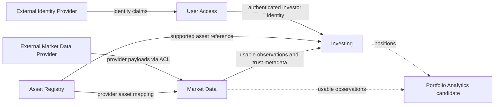
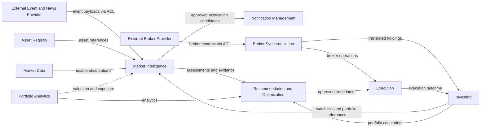

# Domain

## Description

The Market Intelligence Platform domain concerns retail investor market intelligence: helping active investors maintain their investing context, monitor relevant market data, and progressively translate market, news, macro, and geopolitical events into portfolio-aware, risk-aware understanding.

The primary users are active retail investors and, later, small professional investors or independent advisors who manage portfolios or watchlists, follow market developments regularly, and need faster sensemaking than fragmented broker apps, news feeds, social media, charts, and spreadsheets provide.

Users need to know which assets they care about, what is happening in the market, which information is relevant to their holdings or watchlists, whether the data is trustworthy and fresh, and eventually how events may affect their portfolio through clear mechanisms, confidence levels, evidence, and uncertainty.

The platform manages the user’s investing context, including accounts, watchlists, manually entered portfolio positions, supported assets, asset metadata, market prices, financial metrics, data freshness, quality status, source provenance, and later event records, relevance mappings, explanations, feedback, and evaluation history.

The platform helps users reduce attention waste and decision uncertainty by consolidating market context, showing relevant asset and portfolio information in one place, surfacing trustworthy market data with freshness and quality signals, and eventually transforming raw events into portfolio-aware insights rather than opaque trading instructions.

The main difficulty is that financial information is fragmented, time-sensitive, noisy, provider-dependent, and trust-critical. Incorrect identifiers, stale prices, weak provenance, misleading explanations, or overconfident impact claims can directly damage user trust and may create compliance or safety risk.

The full scope of the implementation includes ingestion of market and financial data (historical and real-time), data quality and cleaning, data analytics through dashboard, application with user account, portfolio and watchlist management, ingestion of news,earnings, macro, regulatory, and geopolitical event ingestion, impact assessment of geopolitics on market, and trade recommendations.

The domain explicitly excludes broker-dealer functionality, guaranteed-return positioning, HFT infrastructure, full institutional-terminal replacement, complete multi-asset/global coverage from day one, complex derivatives automation, tax-lot accounting, unrestricted autonomous investing, and any workflow that implies regulated financial advice before the required product, compliance, safety, and trust gates are satisfied.

## Capabilities

1. User, access, consent, and personalization management — Manage user accounts, authentication, authorization, sessions, preferences, activity tracking, consent, and future personalization boundaries.
1. Investing context management — Allow users to create and maintain watchlists, manual portfolios, positions, investing preferences, and later broker-synced holdings or paper portfolios.
1. Asset and instrument identity management — Maintain supported assets, symbols, exchanges, asset metadata, provider identifier mappings, asset classifications.
1. Trusted market-data management — Acquire provider data, translate it into platform-owned observations, evaluate validity, freshness, and completeness, preserve provenance, and make eligible observations available to consumers.
1. Portfolio analytics — Calculate position and portfolio valuation, exposure, performance, and risk summaries using investor context and trustworthy market data.
1. Market intelligence — Ingest, classify, normalize, and enrich external events, including news, earnings, macro, regulatory, and geopolitical developments.
1. Event relevance, impact assessment, and portfolio-aware insight generation — Map events to assets, sectors, geographies, watchlists, and portfolios; assess relevance and potential impact; generate explanations, confidence levels, drivers, source evidence, and portfolio-aware narratives.
1. Notifications, feedback, evaluation, and learning loop — Create and suppress alert candidates, deliver notifications, collect relevance and data-quality feedback, track insight outcomes, evaluate calibration, analyze false positives/false negatives, and support continuous improvement.
1. Recommendation and portfolio optimization — Support future scenario analysis, constraints, objectives, suitability boundaries, and governed decision-support recommendations.
1. Broker account synchronization — Connect broker accounts, translate broker-specific holdings and transactions, and reconcile them with platform asset identity and investor context.
1. Trading and execution readiness — Support future trade-intent, approval, pre-trade control, order submission, execution tracking, audit, and safety workflows.

## Business Workflows

See [workflows](./workflows/)

Phase-one workflows

- Create and maintain a watchlist
- Create and maintain a manual portfolio
- Check portfolio/watchlist market position
- Acquire and publish trustworthy market data
- Report a market-data issue

Future workflows

- Determine event relevance
- Assess potential impact
- Generate portfolio-aware insight
- Deliver and evaluate an insight

## Pain Points

**Pain point: Ambiguous asset identity**

- Workflow: Create and maintain a watchlist; Create and maintain a manual portfolio
- Description: The same ticker symbol may refer to different instruments across exchanges, providers, or asset classes.
- Why it matters: Users may add or value the wrong asset.
- Possible consequence: Loss of trust, incorrect portfolio valuation, incorrect future insights.
- DDD implication: Asset, Symbol, Exchange, ProviderIdentifier, and SupportedAsset need precise language and ownership.

**Pain point: Stale or degraded market data may look trustworthy**

- Workflow: Check portfolio/watchlist market position
- Description: Users may assume displayed prices and metrics are current unless freshness and quality status are explicit.
- Why it matters: Investment decisions are time-sensitive.
- Possible consequence: User acts on outdated or incomplete information.
- DDD implication: Freshness, QualityStatus, and DataProvenance should be explicit domain concepts.

**Pain point: Provider schema or identifier changes can break ingestion**

- Workflow: Acquire and publish trustworthy market data
- Description: External provider data formats, symbols, fields, or semantics may change.
- Why it matters: Data pipelines can fail silently or produce incorrect normalized data.
- Possible consequence: Incorrect data served to users.
- DDD implication: RawProviderResponse, NormalizedMarketData, IngestionRun, and ValidationResult should be explicit concepts.

**Pain point: Users need confidence without receiving financial advice**

- Workflow: Check portfolio/watchlist market position; Generate portfolio-aware insight
- Description: The platform must help users understand market context without implying guaranteed outcomes or regulated advice. Dashboards must not blur raw facts, calculated analytics, and future insights.
- Why it matters: Finance is trust-critical and compliance-sensitive.
- Possible consequence: Regulatory, reputational, and user-trust risk.
- DDD implication: Separate information, insight, recommendation, and action concepts carefully.

**Pain point: Unsupported assets block user intent**

- Workflow: Create and maintain a watchlist; Create and maintain a manual portfolio
- Description: Investors may want to track assets that are not yet in the supported asset registry.
- Why it matters: Users cannot represent their full investing context inside the platform.
- Possible consequence: Abandonment, duplicate tracking outside the platform, missed relevance for future insights.
- DDD implication: SupportedAsset, asset eligibility, and future asset-request flows need explicit language and boundaries.

**Pain point: Manual portfolio state drifts from reality**

- Workflow: Create and maintain a manual portfolio; Check portfolio/watchlist market position
- Description: User-entered quantities and positions can become outdated when trades happen outside the platform.
- Why it matters: Portfolio valuation and future portfolio-aware insights depend on accurate holdings.
- Possible consequence: Misleading valuation, loss of trust, incorrect future impact assessment.
- DDD implication: ManualPortfolio, Position, and valuation outputs should expose maintenance status and last-updated semantics.

**Pain point: Incorrect provider identifier mapping attaches wrong data**

- Workflow: Acquire and publish trustworthy market data
- Description: A provider identifier may map to the wrong internal asset even when ingestion technically succeeds.
- Why it matters: Wrong mappings are harder to detect than missing data and can silently corrupt prices and metrics.
- Possible consequence: Incorrect prices served for the wrong asset, damaged trust, difficult incident diagnosis.
- DDD implication: ProviderMapping, ProviderIdentifierResolution, and validation rules need explicit ownership and review paths.

**Pain point: Partial ingestion success may hide missing data**

- Workflow: Acquire and publish trustworthy market data
- Description: An ingestion run may succeed for some assets while failing or skipping others without making gaps obvious to consumers.
- Why it matters: Users may assume complete coverage when only a subset was updated.
- Possible consequence: Silent data gaps, incomplete portfolio valuation, false confidence in freshness.
- DDD implication: IngestionRun, partial-success status, and serving eligibility must be first-class domain concepts.

**Pain point: Bad provider responses may overwrite previously trusted data**

- Workflow: Acquire and publish trustworthy market data; Check portfolio/watchlist market position
- Description: A new provider response may fail validation or contain bad values, and the platform must not replace good data with worse data.
- Why it matters: Serving bad data is worse than serving slightly stale trusted data.
- Possible consequence: Sudden incorrect prices, valuation spikes/drops, loss of trust.
- DDD implication: Previous trusted data fallback, dataset versioning, and rejection policies must be explicit.

**Pain point: Portfolio valuation may be incomplete or misleading**

- Workflow: Create and maintain a manual portfolio; Check portfolio/watchlist market position
- Description: Valuation can fail or become partial because of missing cost basis, unsupported corporate actions, currency mismatch, or unavailable prices.
- Why it matters: Users may interpret a single portfolio number as complete and accurate.
- Possible consequence: Incorrect P&L, misleading exposure view, wrong sense of portfolio health.
- DDD implication: PositionValuation, PortfolioValuation, cost-basis semantics, currency handling, and partial-valuation status need precise language.

**Pain point: User feedback may lack diagnostic context**

- Workflow: Report a market-data issue; Deliver and evaluate an insight
- Description: Users may report a data or relevance issue without enough context for triage, such as asset, screen, timestamp, or expected vs observed value.
- Why it matters: Low-quality feedback slows correction and weakens the learning loop.
- Possible consequence: Repeated unresolved issues, poor calibration, wasted operator effort.
- DDD implication: DataIssue, Feedback, and triage records should capture structured diagnostic context by design.

## Actors

- Authenticated Investor
- Admin
- Automated triggers
- Market Data Provider
- External Identity Provider
- Broker
- Notification System

## Subdomains

| Subdomain                                 | Purpose                                                                                                                                   | Classification | Horizon   | Confidence | Key rationale                                                                                         |
| ----------------------------------------- | ----------------------------------------------------------------------------------------------------------------------------------------- | -------------- | --------- | ---------- | ----------------------------------------------------------------------------------------------------- |
| Event Relevance                           | Determine whether external events matter to assets, sectors, geographies, watchlists, and portfolios.                                     | Core           | Future    | Medium     | Relevance and noise reduction are central differentiators.                                            |
| Impact Assessment                         | Estimate potential direction, magnitude, confidence, and time horizon of event impact.                                                    | Core           | Future    | Medium     | Explainable, uncertainty-aware impact is central to the product proposition.                          |
| Insight Generation & Explanation          | Produce portfolio-aware insights with explanations, evidence, and uncertainty.                                                            | Core           | Future    | Medium     | Converts interpreted events into differentiated user value.                                           |
| Feedback & Evaluation                     | Capture outcome and relevance feedback and evaluate insight quality and calibration.                                                      | Core           | Future    | Low        | May become a differentiating learning loop; ownership is not yet validated.                           |
| Event Understanding                       | Classify and enrich external events through taxonomy, entity resolution, tagging, and source interpretation.                              | Supporting     | Future    | Medium     | Supplies consistent event meaning to the core intelligence capabilities.                              |
| Portfolio Analytics                       | Calculate valuation, exposure, performance, and basic risk metrics.                                                                       | Supporting     | Phase one | Medium     | Basic valuation is required now; a separate model may emerge as it expands.                           |
| Investor Portfolio & Watchlist Management | Manage user-owned watchlists, portfolios, positions, and investing preferences.                                                           | Supporting     | Phase one | High       | Owns the investor-specific state required by the platform.                                            |
| Asset Registry & Identity                 | Maintain supported instruments, listings, identifiers, provider mappings, and metadata.                                                   | Supporting     | Phase one | High       | Stable identity protects every downstream workflow from symbol ambiguity.                             |
| Market Data Acquisition & Observations    | Acquire provider data and maintain canonical trades, quotes, bars, official prices, and other market observations.                        | Supporting     | Phase one | High       | Separates provider-specific ingestion from platform-owned observation semantics.                      |
| Market Calendar                           | Maintain venue sessions, holidays, time zones, trading phases, halts, and publication schedules used by freshness and valuation policies. | Supporting     | Phase one | Medium     | Freshness cannot be determined by a universal TTL.                                                    |
| Corporate Actions                         | Maintain splits, dividends, mergers, symbol changes, spinoffs, delistings, revisions, and adjustment factors.                             | Supporting     | Phase one | High       | Corporate actions affect instrument continuity, quantities, cash, prices, valuation, and performance. |
| Fundamentals & Estimates                  | Maintain reported financial facts and provider estimates with reporting-period, filing, unit, currency, taxonomy, and revision semantics. | Supporting     | Phase one | High       | Filing data has a different temporal and revision model from market observations.                     |
| Notification Management                   | Apply communication preferences and delivery policies and track notification delivery.                                                    | Generic        | Later     | Low        | Delivery is generic; domain-specific interruption policy may remain upstream.                         |
| Recommendation & Optimization             | Generate governed portfolio scenarios and decision-support recommendations.                                                               | Core           | Future    | Low        | Potential future differentiator with substantial safety and compliance risk.                          |
| Broker Account Synchronization            | Translate and reconcile external broker accounts, holdings, and transactions.                                                             | Supporting     | Later     | Medium     | Protects internal investing models from broker-specific representations.                              |
| Trading & Execution                       | Manage trade intents, approvals, risk checks, order submission, and execution outcomes.                                                   | Supporting     | Future    | Medium     | Distinct regulatory, correctness, and audit requirements justify separation.                          |
| User & Access Management                  | Manage authentication integration, authorization, consent, and access ownership.                                                          | Generic        | Phase one | Medium     | Mostly commodity capability, with platform-specific authorization rules.                              |

## Bounded Context

| Candidate bounded context             | Purpose                                                                                   | Owned concepts                                                                                                                                          | Main workflows                                                         | Upstream dependencies                                                             | Downstream consumers                                      | Horizon           | Confidence / boundary note                                              |
| ------------------------------------- | ----------------------------------------------------------------------------------------- | ------------------------------------------------------------------------------------------------------------------------------------------------------- | ---------------------------------------------------------------------- | --------------------------------------------------------------------------------- | --------------------------------------------------------- | ----------------- | ----------------------------------------------------------------------- |
| User Access Context                   | Integrate identity and enforce access, consent, and ownership boundaries.                 | PlatformUser, Permission, Consent, AccessDecision                                                                                                       | Authenticate user, authorize access, grant/revoke consent              | External identity provider                                                        | All user-owned contexts                                   | Phase one         | Medium: may remain a thin generic integration rather than a rich model. |
| Investing Context                     | Manage user-owned watchlists, portfolios, positions, and investing preferences.           | Watchlist, WatchlistItem, Portfolio, Position, ManualPortfolio                                                                                          | Maintain watchlists and manual portfolios                              | User Access, Asset Registry                                                       | Portfolio Analytics, Market Intelligence                  | Phase one         | High                                                                    |
| Asset Registry Context                | Maintain stable instrument/listing identity and the supported asset universe.             | Instrument, Listing, Symbol, Exchange, ProviderMapping, AssetMetadata, AssetClassification                                                              | Register assets, resolve symbols, map provider IDs, classify assets    | External reference sources                                                        | Investing, Market Data, Market Intelligence               | Phase one         | High                                                                    |
| Market Data Context                   | Maintain trustworthy market observations for supported assets.                            | ProviderPayload, IngestionRun, PriceObservation, ValidationResult, FreshnessEvaluation, Provenance, ServingEligibility                                  | Acquire, translate, validate, and provide usable market observations   | Market data providers, Asset Registry                                             | Investing views, Portfolio Analytics, Market Intelligence | Phase one         | High: acquisition, quality, lineage, and serving begin as one model.    |
| Portfolio Analytics Context           | Calculate valuation, exposure, performance, and risk using investing and market data.     | PositionValuation, PortfolioValuation, Exposure, Performance, RiskProfile                                                                               | Calculate valuation and portfolio analytics                            | Investing, Market Data                                                            | Market Intelligence, Recommendation                       | Phase one / later | Medium: basic valuation may initially remain inside Investing.          |
| Market Intelligence Context           | Interpret events and generate portfolio-aware relevance, impact, and insight assessments. | ExternalEvent, EventTaxonomy, EntityMention, RelevanceAssessment, ImpactAssessment, Insight, Explanation, Evidence, ConfidenceEstimate, InsightFeedback | Understand events, assess relevance/impact, generate/evaluate insights | Event/news providers, Asset Registry, Investing, Market Data, Portfolio Analytics | Notification Management, Recommendation                   | Future            | Medium: possible later split into several contexts.                     |
| Notification Management Context       | Apply communication preferences and track delivery of approved notification candidates.   | NotificationCandidate, Notification, DeliveryStatus, ChannelPreference                                                                                  | Schedule, suppress, deliver, and track notifications                   | Market Intelligence, User Access                                                  | Investor                                                  | Later             | Low: may remain an external delivery adapter until complexity grows.    |
| Recommendation & Optimization Context | Generate governed portfolio scenarios and decision-support recommendations.               | OptimizationScenario, Constraint, Objective, Recommendation, SuitabilityBoundary                                                                        | Optimize portfolios and generate/review recommendations                | Market Intelligence, Portfolio Analytics, Investing                               | Execution                                                 | Future            | Low                                                                     |
| Broker Synchronization Context        | Translate and reconcile external broker accounts, holdings, and transactions.             | BrokerConnection, BrokerAccount, BrokerHolding, BrokerTransaction, BrokerAssetMapping                                                                   | Connect brokers, synchronize holdings, import/reconcile transactions   | Broker provider, User Access, Asset Registry                                      | Investing, Execution                                      | Later             | Medium: anti-corruption boundary for broker-specific representations.   |
| Execution Context                     | Manage trade intents, approval, risk checks, order submission, and execution outcomes.    | TradeIntent, OrderPreview, PreTradeCheck, BrokerOrder, ExecutionReport, KillSwitch                                                                      | Create/approve intent, run checks, submit and reconcile orders         | Recommendation, Broker Synchronization, User Access                               | Investing, audit/reporting                                | Future            | High boundary confidence because of its risk and regulatory profile.    |

### Why Asset Registry is separated from Market Data

- Asset Registry is about identity. Asset Registry answers: “What asset is this?”

- Market Data is about observations and measurements. Market Data answers: “What data do we know about this asset over time?”

- They have different rules

  - Asset Registry rules:

    - Platform assets must have stable internal identity.
    - Symbols are not identity.
    - Provider identifiers must map unambiguously.
    - Only supported assets can be selected.
    - Ambiguous assets require disambiguation.

  - Market Data rules:

    - Raw provider data must be captured where feasible.
    - Data must be normalized before serving.
    - Freshness is separate from validity.
    - Failed data must not be served as healthy.
    - Partial ingestion must be explicit.

- **Ownership:** Asset Registry owns canonical identity and provider mappings. Market Data owns observations, validation results, freshness evaluations, provenance, and serving eligibility.

- **Change frequency:** Asset Registry changes when instruments, listings, symbols, classifications, or mappings change. Market Data changes as observations arrive and when providers, validation rules, or freshness policies change.

- **Integration direction:** Market Data consumes published asset references and provider mappings from Asset Registry. Asset Registry does not depend on market observations.

The separation is logical. Both contexts may remain modules in the same deployable application and may initially share physical infrastructure while preserving ownership.

### Phase-one context map

Portfolio Analytics is shown with dashed relationships because basic valuation may initially remain inside Investing or application-level read-model composition.

### Future context hypotheses

Market Intelligence may later split into Event Understanding, Relevance, Impact Assessment, Insight Generation, and Feedback & Evaluation if they develop distinct language, models, ownership, or rates of change.

### Phase-one context relationships

| Upstream                      | Downstream                      | Contract                                                                         | Relationship pattern              |
| ----------------------------- | ------------------------------- | -------------------------------------------------------------------------------- | --------------------------------- |
| External Identity Provider    | User Access                     | Identity claims                                                                  | Conformist / external integration |
| External Market Data Provider | Market Data                     | Provider payload                                                                 | Anti-corruption layer             |
| Asset Registry                | Investing                       | Supported asset reference                                                        | Published language                |
| Asset Registry                | Market Data                     | Provider asset mapping                                                           | Published language                |
| Market Data                   | Investing / Portfolio Analytics | Usable observation with validity, freshness, provenance, and serving eligibility | Customer–supplier                 |

## Possible Ambiguous Language Candidates

| Term                | Ambiguity                                                                                       | Recommended distinction                                                                                                         |
| ------------------- | ----------------------------------------------------------------------------------------------- | ------------------------------------------------------------------------------------------------------------------------------- |
| Asset               | Could mean security, instrument, symbol, provider object, portfolio holding, or watchlist item. | Use `Asset` for platform-supported instrument identity. Use `Position` for user holding. Use `WatchlistItem` for tracked asset. |
| Symbol / Ticker     | Same ticker may exist on multiple exchanges or providers.                                       | Treat symbol as display/search attribute, never identity.                                                                       |
| Provider Identifier | Could be mistaken for internal asset identity.                                                  | Provider ID is external mapping only; internal `asset_id` is source of truth.                                                   |
| Watchlist Asset     | Could be confused with owned holding.                                                           | Watchlist item means interest/tracking, not ownership.                                                                          |
| Portfolio Position  | Could be confused with asset itself.                                                            | Position is user-specific holding/reference to an asset plus quantity/cost data.                                                |
| Portfolio           | Could mean real holdings, paper portfolio, broker account, strategy, or view.                   | Distinguish `ManualPortfolio`, `PaperPortfolio`, `BrokerSyncedPortfolio` later.                                                 |
| Market Data         | Could mean raw provider data, normalized data, validated data, or served data.                  | Use ProviderPayload, MarketObservation, ValidatedObservation, UsableObservation, ServingEligibility                             |
| Latest Price        | Could mean provider latest, platform latest, or latest validated.                               | Use `LatestProviderPrice` vs `LatestValidatedPrice`.                                                                            |
| Fresh               | Could be confused with valid/correct.                                                           | Freshness is time-based; validity is quality-rule-based.                                                                        |
| Healthy             | Could mean technically ingested or business-trustworthy.                                        | Healthy means passed quality and serving eligibility checks.                                                                    |
| Degraded            | Could mean incomplete, stale, partial, or low confidence.                                       | Define explicit statuses: `partial`, `stale`, `degraded`, `failed`.                                                             |
| Event               | Could mean domain event, market news event, system event, product usage event.                  | Use `DomainEvent`, `ExternalMarketEvent`, `SystemEvent`, `UsageEvent`.                                                          |
| Insight             | Could mean raw data, analytics, explanation, recommendation, or alert.                          | Insight should mean interpreted, user-facing intelligence with evidence/uncertainty.                                            |
| Impact              | Could mean price move, causal effect, risk exposure, or user action.                            | Define impact as estimated effect with direction, magnitude, horizon, confidence, drivers.                                      |
| Recommendation      | Could imply financial advice.                                                                   | Prefer `Consideration`, `Scenario`, or `Decision Support Recommendation` until governance matures.                              |
| Alert               | Could mean notification, volatility signal, event signal, or insight.                           | Separate `NotificationCandidate`, `AlertPolicy`, and `NotificationDelivery`.                                                    |
| Valuation           | Could mean position value, portfolio value, P&L, performance, or risk.                          | Separate `PositionValuation`, `PortfolioValuation`, `Performance`, `Exposure`.                                                  |
| User                | Could mean authenticated identity, investor, admin, support operator.                           | Use `Investor`, `InternalOperator`, `SupportUser`, `AdminUser`.                                                                 |
| Data Issue          | Could mean provider error, user misunderstanding, stale data, wrong mapping, or UI confusion.   | Data issue report must include category and diagnostic context.                                                                 |
| Audit               | Could mean security logs, data lineage, model provenance, execution records.                    | Separate `AuditRecord`, `LineageRecord`, `ModelProvenance`, `ExecutionAudit`.                                                   |
