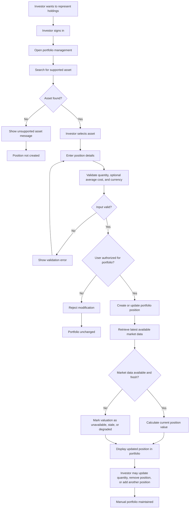

# Workflow: Create and Maintain Manual Portfolio

## Actors

- Authenticated Investor
- Market Intelligence Platform
- Asset Registry
- Market Data Foundation

## Trigger

The investor wants to represent their actual or simulated holdings inside the platform.

## Main path

1. Investor opens portfolio management.
1. Investor searches for a supported asset.
1. Investor selects the correct asset.
1. Investor enters position details such as quantity and, optionally, average cost.
1. Platform validates the position input.
1. Platform records or updates the portfolio position.
1. Platform calculates basic current position value using available market data.
1. Platform shows the position in the portfolio view with freshness and quality status.

## Alternative paths

- Investor updates quantity after buying or selling outside the platform.
- Investor removes a position.
- Investor enters only quantity and skips average cost.
- Investor maintains a manual paper portfolio rather than real holdings.
- Investor creates a portfolio from watchlist items.

## Failure paths

- Asset is unsupported.
- Quantity is invalid.
- Average cost is invalid or incompatible with the asset currency.
- Latest price is missing, stale, or degraded.
- User attempts to modify another user's portfolio.
- Corporate action or symbol change makes the position difficult to interpret.

## Business outcome

The investor has a user-owned portfolio context that can support valuation, monitoring, and future portfolio-aware intelligence.

