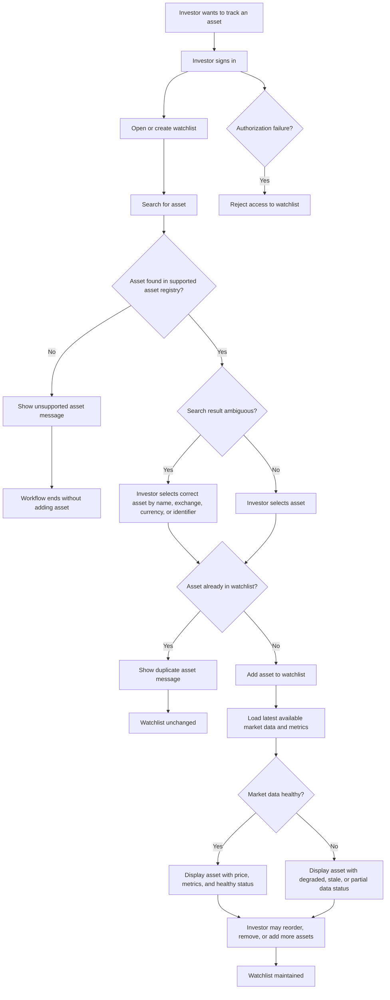

# Workflow #1: Create and Maintain Watchlist

## Actors

- Authenticated Investor
- Market Intelligence Platform
- Asset Registry
- Market Data Provider, indirectly through already-ingested data

## Trigger

The investor wants to track assets they care about without entering full portfolio positions.

## Main path

1. Investor signs in.
1. Investor creates a watchlist or opens an existing watchlist.
1. Investor searches for an asset by symbol, name, exchange, or supported identifier.
1. Platform returns matching supported assets.
1. Investor selects the correct asset.
1. Platform adds the asset to the selected watchlist.
1. Platform displays the asset in the watchlist with available price, basic metrics, and freshness/quality status.
1. Investor may remove assets, reorder assets, or maintain multiple watchlists later.

## Alternative paths

- Investor adds an asset to a default watchlist without explicitly creating one.
- Investor creates multiple watchlists for different strategies or themes.
- Investor removes an asset from the watchlist.
- Platform groups assets in themes and recommends to the user a theme based on his interests.

## Failure paths

- Asset is unsupported.
- Asset search returns ambiguous symbols across exchanges.
- Asset is already in the watchlist.
- Latest market data is unavailable or stale.
- User is not authorized to modify the watchlist.
- Provider identifier mapping is missing or inconsistent.

## Business outcome

The investor has a maintained list of relevant assets that can be used for recurring market checks and future personalized insights.

