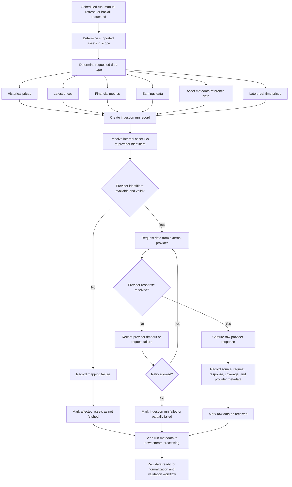

# Workflow: Ingest Market and Financial Data

## Actors

- Market Intelligence Platform
- Scheduled Job / Internal Operator
- External Market Data Provider
- Asset Registry
- Ingestion Run Tracker

## Trigger

A scheduled ingestion run, manual refresh, or backfill request requires the platform to fetch market or financial data for supported assets.

## Data types covered in this workflow

- Historical prices
- Latest prices
- Financial metrics
- Earnings data
- Asset metadata or reference data
- Later: real-time price data

## Main path

1. Platform determines which supported assets require data.
1. Platform determines the ingestion type: historical price, latest price, financial metrics, earnings, metadata, or later real-time data.
1. Platform creates an ingestion run record with scope, provider, requested data type, and execution timestamp.
1. Platform resolves internal asset IDs to provider-specific identifiers.
1. Platform sends the data request to the selected external provider.
1. Provider returns the requested data.
1. Platform captures the raw provider response or source snapshot.
1. Platform records provider metadata such as source, request timestamp, response timestamp, provider status, and data coverage.
1. Platform marks the ingestion request as received for downstream processing.
1. Platform passes the raw received data to the data processing, normalization, and validation workflow.

## Alternative paths

- Platform fetches historical data for a date range instead of latest data.
- Platform fetches metrics or earnings data instead of prices.
- Platform performs a manual backfill for missing or corrected data.
- Platform partially succeeds for some assets and fails for others.
- Platform skips inactive, unsupported, or unmapped assets.
- Platform retries transient provider failures.
- Platform receives a provider response with incomplete data coverage.

## Failure paths

- Provider is unavailable.
- Provider request times out.
- Provider rate limit is exceeded.
- Provider credentials are invalid.
- Provider identifier mapping is missing.
- Provider identifier mapping is incorrect.
- Requested asset is unsupported.
- Provider returns unexpected or empty data.
- Ingestion run fails before raw data is captured.

## Business outcome

The platform has captured raw provider data and ingestion metadata for supported market and financial data types, ready for normalization, validation, lineage tracking, and eventual serving.

