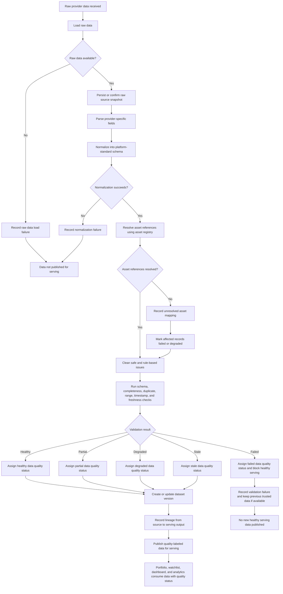

# Workflow: Normalize, Clean, Validate, and Publish Market Data

## Actors

- Market Intelligence Platform
- Data Processing Pipeline
- Data Quality Process
- Asset Registry
- Market Data Store
- Data Registry / Lineage Store
- Portfolio, Watchlist, Dashboard, and Analytics consumers

## Trigger

Raw provider data has been received from an ingestion workflow and needs to be transformed into trusted market data.

## Data types covered in this workflow

- Raw historical price data
- Raw latest price data
- Raw financial metrics
- Raw earnings data
- Raw asset metadata/reference data
- Later: raw real-time price messages

## Main path

1. Platform loads raw provider data from the ingestion output.
1. Platform records or confirms raw data persistence for replay and auditability.
1. Platform parses provider-specific fields.
1. Platform normalizes raw data into platform-standard schemas.
1. Platform resolves asset references against the internal asset registry.
1. Platform cleans data where safe and rule-based, such as formatting, type coercion, timestamp normalization, currency normalization where supported, and duplicate removal.
1. Platform validates schema, required fields, completeness, duplicate records, value ranges, timestamp consistency, and freshness.
1. Platform assigns a data quality status such as healthy, partial, degraded, stale, or failed.
1. Platform creates or updates dataset version metadata.
1. Platform records lineage from provider source to raw data, normalized data, validation results, and serving-ready output.
1. Platform publishes only valid or explicitly quality-labeled data for serving.
1. Portfolio, watchlist, dashboard, and analytics workflows consume the serving-ready data and its quality/freshness status.

## Alternative paths

- Data passes all checks and is marked healthy.
- Data is usable but incomplete and is marked partial.
- Data is available but stale and is marked stale.
- Data contains non-critical issues and is marked degraded.
- Data fails validation and is blocked from healthy serving.
- Some assets pass validation while others fail.
- Previously served data remains active while new data is rejected.
- A dataset is regenerated through replay or backfill.

## Failure paths

- Raw data cannot be loaded.
- Provider schema changed unexpectedly.
- Normalization fails.
- Asset reference cannot be resolved.
- Required fields are missing.
- Duplicate records cannot be safely resolved.
- Data contains impossible values, such as negative prices.
- Data is stale beyond the allowed threshold.
- Dataset version cannot be created.
- Lineage cannot be recorded.
- No trustworthy data is available for serving.

## Business outcome

The platform has trusted, normalized, traceable, and quality-labeled market data that can safely power watchlists, portfolios, dashboards, analytics, and future insight-generation workflows.

